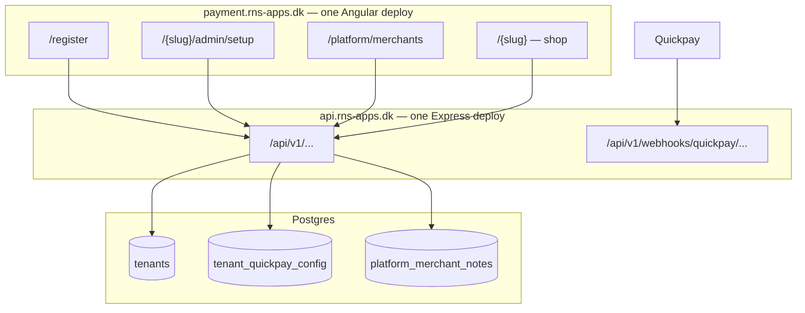
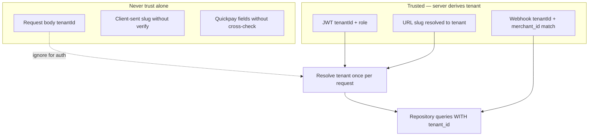

# RNS-Apps platform — merchant overview & onboarding

**Plan #:** 001
**Status:** not integrated
**Created:** 2026-06-07
**Last updated:** 2026-06-07
**Domains:** `payment.rns-apps.dk` (SPA) · `api.rns-apps.dk` (API)

---

## 1. Purpose

RNS-Apps operates a **multi-tenant payment/shop SaaS**. Two distinct experiences:

| Surface | Who | URL pattern | Goal |
|---------|-----|-------------|------|
| **Merchant admin** | Shop owner / staff | `payment.rns-apps.dk/{slug}/admin/...` | Run their shop, paste Quickpay keys, follow guides |
| **RNS platform** | RNS-Apps staff | `payment.rns-apps.dk/platform/...` | Overview of **all merchants**, health, support context |

Merchants onboard with **Quickpay BYOK**. **Clearhaus** is merchant ↔ Clearhaus (RNS guides, does not negotiate). **Webhooks** are set in API code on `api.rns-apps.dk`, not pasted in Quickpay Manager (optional fallback).

---

## 2. Architecture



**Tenant routing:** path segment `/{slug}` for merchant-facing routes.  
**Platform routes:** `/platform/*` — no slug; `platform_admin` role only.  
**No per-merchant Render deploy.** New merchant = new DB rows + slug.

---

## 3. Merchant onboarding (recap)

### 3.1 What the app collects

| Field | Stored |
|-------|--------|
| Shop name, slug | `tenants` |
| Admin email, password | `users` |
| Quickpay Merchant ID, Private key, Payment Window API key | `tenant_quickpay_config` (encrypted) |

Everything else (Quickpay account creation, Clearhaus, go-live) → **guides + RNS support call**.

### 3.2 Merchant setup page

**URL:** `payment.rns-apps.dk/{slug}/admin/setup`

- Left: form + Save + **Quickpay: Connected / Error** (ping)
- Right: links to `docs/setup-guides/`
- Webhook: informational only (“set automatically by our API”)

### 3.3 Support call (30 min)

1. Register at `/register` → confirm `payment.rns-apps.dk/{slug}`
2. Screen-share Quickpay → paste keys → Connected
3. Send Clearhaus guide — merchant applies direct
4. Smoke test when checkout exists

---

## 4. RNS platform — merchant overview

### 4.1 Why we need it

Without a platform view, RNS staff must query the DB or ask merchants for status. The platform gives **one place** to:

- See who is onboarded, stuck, or live
- Open the right links (shop, setup) in one click
- Record support notes and follow-ups
- Re-test Quickpay without merchant involvement
- Proactively keep merchants happy before they churn

### 4.2 Primary screen: merchant list

**URL:** `payment.rns-apps.dk/platform/merchants`

**Table columns (v1):**

| Column | Source | Why it matters |
|--------|--------|----------------|
| Shop name | `tenants.name` | Recognition |
| Slug | `tenants.slug` | Links |
| Created | `tenants.createdAt` | Onboarding age |
| Quickpay | `quickpayConnectedAt` + last ping | Payment readiness |
| Quickpay Merchant ID | `tenant_quickpay_config.merchantId` | Support / Quickpay Manager lookup |
| Clearhaus | manual flag `clearhausConfirmedAt` | Live vs test-only |
| Status | derived enum (see §4.4) | At-a-glance health |
| Primary contact | admin user email | Who to email/call |
| Actions | — | Open setup, shop, re-ping, add note |

**Filters:** status, Quickpay connected, created date range, search by name/slug/email.

**Pagination:** required (project rule — default 20, max 100).

### 4.3 Merchant detail screen

**URL:** `payment.rns-apps.dk/platform/merchants/{tenantId}`

**Sections:**

1. **Summary** — name, slug, status badge, created/updated
2. **Quick links**
   - Shop: `payment.rns-apps.dk/{slug}`
   - Setup: `payment.rns-apps.dk/{slug}/admin/setup`
   - Webhook URL (read-only): `https://api.rns-apps.dk/api/v1/webhooks/quickpay/{tenantId}`
3. **Payments**
   - Quickpay connected? last ping time, last error message
   - Button: **Re-test Quickpay** (server ping, no key re-entry)
   - Clearhaus: checkbox + date “confirmed live” (RNS sets after merchant confirms)
4. **People** — admin users (email, role, created); invite link (v1.1)
5. **Support notes** — chronological list (RNS-only), add note form
6. **Activity** (v2) — last order, last login, payment volume

### 4.4 Merchant status (derived)

Simple enum for list filtering and support prioritisation:

| Status | Meaning |
|--------|---------|
| `registered` | Tenant exists, Quickpay not connected |
| `quickpay_connected` | Ping OK, test payments possible |
| `clearhaus_pending` | Connected but Clearhaus not confirmed |
| `live` | RNS marked Clearhaus confirmed + merchant activated Quickpay production |
| `attention` | Ping failed or keys missing after prior success |

No complex state machine in v1 — derive from timestamps + manual Clearhaus flag.

### 4.5 Actions RNS staff need

| Action | v1 | Notes |
|--------|-----|-------|
| List all merchants | Yes | Paginated |
| View merchant detail | Yes | |
| Create tenant + invite | v1.1 | Pre-set slug/name; merchant sets password + keys |
| Re-test Quickpay ping | Yes | From detail page |
| Mark Clearhaus live | Yes | Manual flag + optional date |
| Add internal support note | Yes | Not visible to merchant |
| Edit merchant slug/name | v1.1 | Rare; careful with links |
| Impersonate / login as merchant | v2 | Audit-heavy |
| Export merchant list CSV | v2 | |

### 4.6 What keeps merchants happy (operational playbook)

Information the platform should surface so RNS can act **before** merchants complain:

| Signal | Platform shows | RNS action |
|--------|----------------|------------|
| Registered 7+ days, no Quickpay | Status `registered`, age | Email + offer setup call |
| Quickpay ping failed | `attention`, last error | Call merchant, fix keys |
| Connected but no Clearhaus flag 14+ days | `clearhaus_pending` | Send guide 3, ask for status |
| Live but no orders (v2) | Zero activity | Check-in: marketing? checkout broken? |
| Note from last call | Support notes | Continuity on next contact |

**Internal runbook:** `docs/setup-guides/RNS-support-runbook.md` (30-min call script + when to follow up).

---

## 5. Auth & roles

| Role | Scope | Routes |
|------|-------|--------|
| `admin` | One tenant | `/{slug}/admin/*` |
| `platform_admin` | All tenants | `/platform/*` |

- Platform users are **RNS staff** — not merchant users. Separate seed or env-based bootstrap (`PLATFORM_ADMIN_EMAIL`).
- JWT includes `role` + `tenantId` (null or omitted for platform routes).
- Platform API routes: `requirePlatformAdmin` middleware.
- Merchant admin: JWT `tenantId` must match slug on URL.

**Full rules:** see **§12 Security & tenant isolation** (payments + data access).

---

## 6. Data model

### 6.1 Existing / onboarding slice

```prisma
model Tenant {
  id                   String    @id @default(uuid())
  name                 String
  slug                 String    @unique
  quickpayConnectedAt  DateTime?
  clearhausConfirmedAt DateTime?  // RNS sets when merchant is live
  createdAt            DateTime  @default(now())
  updatedAt            DateTime  @updatedAt
  users                User[]
  quickpayConfig       TenantQuickpayConfig?
  platformNotes        PlatformMerchantNote[]
}

model TenantQuickpayConfig {
  tenantId     String   @unique
  merchantId   String
  privateKey   String   // encrypted at rest
  apiKey       String   // encrypted at rest
  lastPingAt   DateTime?
  lastPingOk   Boolean?
  lastPingError String?
  tenant       Tenant   @relation(...)
}

model User {
  // existing + role: "admin" | "platform_admin"
}
```

### 6.2 Platform ops (new)

```prisma
model PlatformMerchantNote {
  id        String   @id @default(uuid())
  tenantId  String
  authorId  String   // platform_admin user
  body      String
  createdAt DateTime @default(now())
  tenant    Tenant   @relation(...)
  author    User     @relation(...)
}
```

Optional v1.1: `TenantInvite` (token, email, expiresAt) for pre-created tenants.

---

## 7. API

### 7.1 Merchant (existing plan)

| Method | Path |
|--------|------|
| POST | `/api/v1/auth/register` |
| POST | `/api/v1/auth/login` |
| GET | `/api/v1/setup` |
| PUT | `/api/v1/setup/quickpay` |

### 7.2 Platform (new)

| Method | Path | Purpose |
|--------|------|---------|
| GET | `/api/v1/platform/merchants` | Paginated list + filters |
| GET | `/api/v1/platform/merchants/:tenantId` | Detail |
| POST | `/api/v1/platform/merchants` | Create tenant (v1.1) |
| POST | `/api/v1/platform/merchants/:tenantId/ping-quickpay` | Re-test connection |
| PATCH | `/api/v1/platform/merchants/:tenantId` | Update clearhaus flag, name (v1.1) |
| GET | `/api/v1/platform/merchants/:tenantId/notes` | Support notes |
| POST | `/api/v1/platform/merchants/:tenantId/notes` | Add note |

Shared types in `Shared/types/platform/` and `Shared/types/onboarding/`.

---

## 8. Client structure

```text
Client/src/app/features/
  admin/           # Merchant: /{slug}/admin/setup
  platform/        # RNS: /platform/merchants, /platform/merchants/:id
  shop/            # /{slug}
  register/        # /register

Client/src/app/core/
  guards/          # authGuard, platformAdminGuard, tenantSlugGuard
  services/        # auth, setup, platform-merchants
```

**Routes (sketch):**

```text
/register
/platform/merchants
/platform/merchants/:tenantId
/:tenantSlug              → shop
/:tenantSlug/admin/setup  → merchant setup
```

---

## 9. Implementation phases

### Phase A — Foundation (merchant can connect Quickpay)

- [ ] Prisma: Tenant, TenantQuickpayConfig, User roles
- [ ] Auth: register, login, JWT, guards
- [ ] Slug-based routing `/:tenantSlug`
- [ ] Merchant setup page + Quickpay ping
- [ ] `docs/setup-guides/` + RNS support runbook
- [ ] Env: `API_PUBLIC_URL`, `JWT_SECRET`, `ENCRYPTION_KEY`
- [ ] **Security:** `tenantSlugGuard`, JWT/slug match middleware, tenant-scoped repositories (§12)

### Phase B — RNS platform overview (this plan’s focus)

- [ ] `platform_admin` role + bootstrap user
- [ ] Platform merchant list (paginated, filters, status derivation)
- [ ] Platform merchant detail (links, Quickpay status, re-ping)
- [ ] Clearhaus confirmed flag (PATCH)
- [ ] Platform support notes (list + create)
- [ ] Route `/platform/*` + `platformAdminGuard`
- [ ] **Security:** platform routes never callable with merchant JWT; notes/keys not in merchant API (§12)

### Phase C — Ops polish (v1.1)

- [ ] Create tenant from platform + invite link
- [ ] Dev seed: `npm run seed:platform-admin`, `npm run seed:tenant`
- [ ] Dashboard widgets: counts by status (registered / connected / live)

### Phase D — Later

- [ ] Checkout + webhooks (Quickpay callback in code)
- [ ] **Security:** webhook checksum + merchant_id cross-check, payment–tenant binding tests (§12.3)
- [ ] Custom domains
- [ ] Verifone POS Cloud (kasse)
- [ ] Activity metrics, CSV export, impersonation

---

## 10. Render deployment (RNS, once)

| Service | Domain | Notes |
|---------|--------|-------|
| Angular | `payment.rns-apps.dk` | SPA fallback for `/{slug}/...` and `/platform/...` |
| Express | `api.rns-apps.dk` | `API_PUBLIC_URL=https://api.rns-apps.dk` |
| Postgres | internal | Attached to API |

---

## 11. Success criteria

**Merchant onboarding**

- Register → setup → Quickpay **Connected** without RNS editing DB

**RNS platform**

- Open `/platform/merchants` and see every tenant with status and Quickpay health
- One click to shop/setup URLs for any merchant
- Re-ping Quickpay from detail page
- Add a support note after a call; visible on next open
- Mark merchant **live** when Clearhaus is confirmed

**Operational**

- New merchant #N requires zero infra changes
- Support call uses single setup URL + guides; platform records outcome

**Security**

- Merchant A cannot read or mutate Merchant B’s data (API returns 403/404, never another tenant’s rows)
- Checkout for `{slug}` always uses **that** tenant’s Quickpay credentials; money routes to their Quickpay merchant account
- Webhook for tenant A cannot update tenant B’s orders (merchant_id + checksum + tenant binding)
- Integration tests cover cross-tenant access attempts on setup, shop, and payment paths

---

## 12. Security & tenant isolation

**Goal:** The right merchant always gets paid. No merchant sees another merchant’s data, keys, orders, or platform notes.

### 12.1 Trust boundaries



| Source | Use for tenant? |
|--------|----------------|
| JWT `tenantId` (merchant admin) | Yes — must match URL `/{slug}` |
| URL `/{slug}` (public shop / checkout) | Yes — resolve slug → `tenant_id` server-side |
| Request body `tenantId` | **No** — ignore for authorization |
| Quickpay webhook `merchant_id` | Yes — must match stored config for webhook path tenant |
| Platform JWT (`platform_admin`) | Cross-tenant read/write only on `/platform/*` routes |

### 12.2 Data isolation (no shared information between merchants)

**Repository rule:** every tenant-scoped `findMany` / `findUnique` / `update` includes `where: { tenantId }` from the **resolved** tenant, never from the client body.

| Data | Merchant API | Platform API |
|------|--------------|--------------|
| Own shop / setup / orders | Yes (scoped) | — |
| Other merchant’s shop / orders | **Never** | — |
| Quickpay private key / API key | Write only; read masked | Never expose full key in UI (platform sees merchant ID + ping status only) |
| Platform support notes | **Never** | Yes |
| List of all merchants | **Never** | Yes (`platform_admin`) |

**API behaviour**

- Wrong tenant on IDOR attempt → **404** (same as not found) or **403** — pick one convention and use consistently; do not return another tenant’s data.
- Merchant routes under `/api/v1/setup`, `/api/v1/orders`, etc. require JWT + `requireTenantMatch(slug)`.
- `/api/v1/platform/*` requires `platform_admin`; merchant JWT → **403** even if valid.

**Client**

- `tenantSlugGuard`: logged-in merchant’s tenant slug must equal route `:tenantSlug`.
- Do not store other tenants’ data in services; no shared cache keys without tenant prefix (when caching is added later).

### 12.3 Payment isolation (right merchant gets paid)

Critical path when checkout is built (Phase D); design now so schema and services do not need rework.

**Create payment**

1. Customer hits `payment.rns-apps.dk/{slug}/checkout`.
2. Server resolves **tenant from slug** (not body).
3. Load `TenantQuickpayConfig` **only** for that `tenant_id`.
4. Create `Order` with `tenant_id` + `order_id` unique per tenant.
5. Call Quickpay API using **that tenant’s** Payment Window API key.
6. Set `callbackurl` to `https://api.rns-apps.dk/api/v1/webhooks/quickpay/{tenantId}` (or single URL + resolve by `merchant_id` — if single URL, still verify `merchant_id` below).
7. Store `Payment` row: `tenant_id`, `order_id`, `quickpay_payment_id`, `quickpay_merchant_id` (copy from config at creation time).

**Webhook**

1. Receive POST at webhook route.
2. Identify tenant (path `tenantId` and/or lookup by Quickpay `merchant_id` in payload).
3. **Cross-check:** payload `merchant_id` === `tenant_quickpay_config.merchantId` for that tenant. If mismatch → **400**, log alert, do not update any order.
4. Verify Quickpay **checksum** using **that tenant’s** private key ([Quickpay callback docs](https://learn.quickpay.net/tech-talk/api/callback/)).
5. Load `Payment` by `quickpay_payment_id` **and** `tenant_id`. If not found → **404**.
6. Update order state inside transaction; idempotency key on webhook event id.

**Invariants (must always hold)**

- Quickpay API calls use credentials from DB row where `tenant_id` = resolved tenant.
- No global/platform Quickpay key for merchant checkouts (platform has no “shared” acquirer pot).
- `Payment.tenant_id` === `Order.tenant_id` === config used for the Quickpay call.
- Merchant A cannot create a payment on Merchant B’s slug without B’s credentials (public checkout only uses slug-resolved tenant — attacker cannot inject another tenant’s keys).

### 12.4 Secrets & logging

- Encrypt Quickpay private key and API key at rest (`ENCRYPTION_KEY`).
- Never log private keys, API keys, full webhook bodies with card data, or PANs.
- Structured logs may include `tenantId`, `slug`, `quickpay_payment_id`, correlation id — not secrets.
- Setup API returns masked keys (`••••last4`) after initial save.

### 12.5 Middleware & guards (implementation checklist)

| Layer | Responsibility |
|-------|----------------|
| `resolveTenantFromSlug` | Public routes: `{slug}` → tenant or 404 |
| `requireAuth` | Valid JWT |
| `requireTenantMatch` | JWT `tenantId` matches slug / route tenant |
| `requirePlatformAdmin` | Role `platform_admin` for `/platform/*` |
| `tenantRepository.*` | All methods require `tenantId` parameter |
| Quickpay adapter | Accept `tenantId`; load config inside adapter, never accept raw API key from caller |

### 12.6 Tests (required before production payments)

- Merchant A token cannot `GET/PUT /api/v1/setup` for merchant B’s slug → 403/404.
- Merchant A cannot access platform list → 403.
- Platform admin cannot use merchant-only routes without impersonation (v2).
- Checkout on slug A creates Quickpay payment with A’s merchant id (mock Quickpay).
- Webhook with A’s merchant_id updates only A’s order; same payload against B’s webhook path with wrong merchant_id → rejected.
- Webhook replay / duplicate → idempotent, no double capture.

---

## 13. Out of scope (explicit)

- Quickpay merchant auto-provisioning (no API)
- Per-merchant Render deploys
- RNS negotiating Clearhaus on behalf of merchants
- Full CRM, billing for RNS SaaS fees, or ticket system (notes only in v1)
- Merchant-visible support notes (internal only)

---

## Related

- Rules: [payment-setup.mdc](../../.cursor/rules/payment-setup.mdc), [keep-code-simple.mdc](../../.cursor/rules/keep-code-simple.mdc), [tenant-security.mdc](../../.cursor/rules/tenant-security.mdc), [cursor-plans.mdc](../../.cursor/rules/cursor-plans.mdc)
- Payment rails: **Quickpay** (online), **Verifone POS Cloud** (terminals, later)
