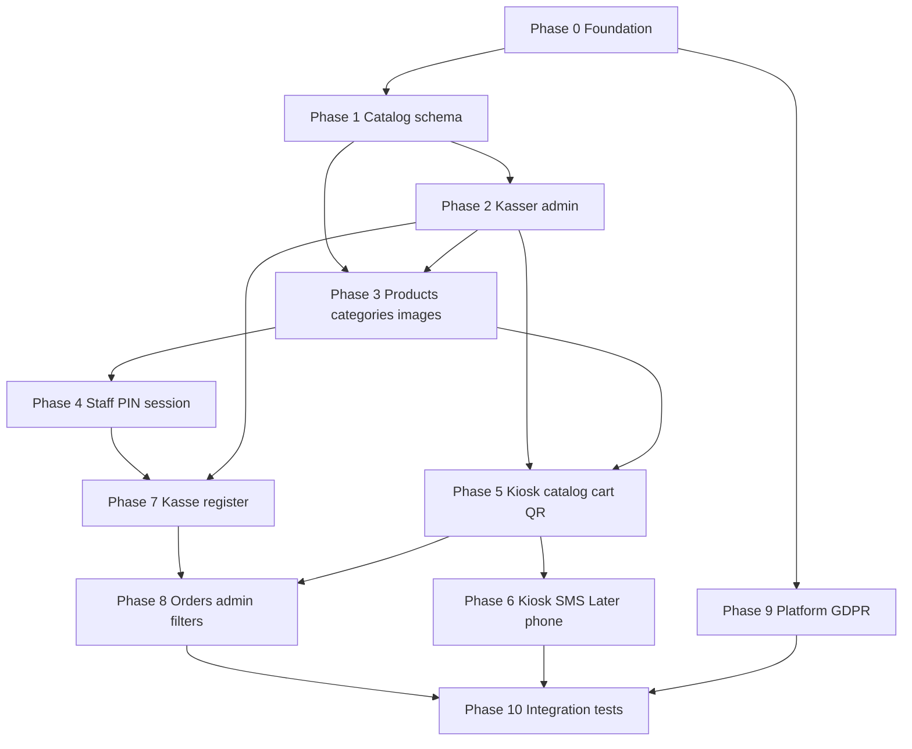

# POS full implementation — roadmap & phases

**Plan #:** 003  
**Status:** not integrated  
**Created:** 2026-06-08  

> **For agentic workers:** Use `superpowers:executing-plans` or `superpowers:subagent-driven-development` **one phase per worktree**. Do not implement multiple phases on `master` at once.  
> **REQUIRED:** `git-worktree-workflow.mdc` — `npm run worktree:new -- feature/<phase-branch>` before coding.

**Goal:** Implement the full POS design (platform, merchant admin, customer kiosk, staff kasse) per the canonical spec and interactive prototype.

**Architecture:** Vertical slices per phase — Prisma → repository → service → controller → route → `Shared/types` → client service → page. One Angular SPA with four layout shells. Payments: Quickpay (online/kiosk/kasse QR) + Verifone POS Cloud (register).

**Tech stack:** Angular (Client), Express + Prisma (Server), PostgreSQL, Quickpay v10, Verifone POS Cloud, shared types in `Shared/types/`.

**Canonical references:**
- [Design spec](../../docs/superpowers/specs/2026-06-08-pos-three-sites-design.md) (§3.1–3.14)
- [Page features & flows](../../docs/design/page-features-and-flows.md)
- [Interactive prototype](../../docs/design/interactive.html)
- [Platform plan 001](./001-rns-platform-merchant-overview.md) (partially done)
- Rules: `tenant-security.mdc`, `payment-setup.mdc`, `keep-code-simple.mdc`

---

## Revision — simpler roadmap (recommended)

The **10-phase plan below** is complete but **over-split**. Reflection:

| Problem with original plan | Simpler fix |
|----------------------------|-------------|
| Phase 1 = schema only, no UI | Every phase should ship something **testable in the browser** |
| Phases 2 + 3 = admin without catalog, then catalog | One **merchant catalog** worktree: migration + kasser + products + categories |
| Phase 6 = SMS provider integration | **Defer SMS to v1.1** — ship QR + pay later first (no third-party SMS) |
| Phase 8 = orders filters alone | Fold into the phase that adds `kasseId` / `staffUserId` to orders |
| Phase 9 = full GDPR purge job | **v1:** archive + export only; full erasure job when first offboarding happens |
| Phase 10 = all tests at end | One **tenant-isolation test** per payment phase, not a big-bang QA phase |
| `kasse.repository.interface.ts` separate file | Co-locate `IKasseRepository` in `kasse.repository.ts` (matches existing repos) |
| Four layout shell components upfront | **AdminLayout** first; kiosk/kasse = thin route wrappers until reuse is obvious |
| New service per surface | **One `catalog.service.ts`** for kiosk + kasse catalog GET (same `ProductKasse` filter) |
| Extend checkout vs new kiosk service | **Extend `checkout.service.ts`** for line-item cart — same Quickpay path |

### Simplified phases (6 worktrees → production v1)

| # | Branch | Delivers | Defer |
|---|--------|----------|-------|
| **A** | `feature/merchant-catalog` | Migration (all catalog tables + Order extensions), AdminLayout, kasser + categories + products + images, default kiosk seed | — |
| **B** | `feature/kiosk-checkout` | Kiosk routes, catalog GET, client cart, line-item checkout, **QR only**, phone gate + **pay later** | SMS |
| **C** | `feature/staff-kasse` | Staff CRUD, PIN session, `/:slug/kasse/:slug` register, Verifone per-kasse POI, kasse QR, order line items + `kasseId`/`staffUserId` | Receipt page if inline OK |
| **D** | `feature/orders-attribution` | Admin order filters (kasse, employee), detail with lines — small delta on C | — |
| **E** | `feature/platform-archive` | Export ZIP + archive merchant (no async purge job yet) | Full erasure worker |
| **F** | `feature/kiosk-sms` | SMS adapter + checkout/sms (when provider chosen) | Until after v1 live |

**Dependency order:** A → B and A → C (B and C can run in parallel after A). D after B+C. E anytime after Phase 0. F last.

**Use the detailed phases 1–10 below** as task checklists inside A–F, not as separate merges.

### Shared UI components (build once in Phase A)

Location: `Client/src/app/shared/components/` (folder exists as `.gitkeep`). **Minimal markup, no design system** until asked — components encode **structure + behaviour** only.

| Component | Replaces duplicate in | Used on |
|-----------|----------------------|---------|
| **`pos-button`** | Raw `<button [disabled]="loading()">` × 30+ | Admin, platform, kiosk, kasse — `variant`: `primary` \| `secondary` \| `danger` \| `ghost`; `loading` disables + shows label |
| **`confirm-dialog`** | One-off confirms + inline toggles like refund | Deactivate product/kasse/staff, archive merchant, void/abort sale — native `<dialog>` + `confirm()` / `cancel()` outputs |
| **`copy-field`** | Copy invite link, kasse URL, payment link | Platform invite, admin kasser edit, order detail |
| **`paginator`** | Identical prev/next blocks | Orders list, merchants list, products list, categories |
| **`async-shell`** | `@if (loading) … @else if (error)` | Any page that loads one resource — projects content via `ng-content`; slots: loading, error, empty |
| **`form-actions`** | Save + Cancel + danger row on every edit form | Product/category/kasse/staff edit |
| **`numeric-pad`** | `pinPadHtml` + `phonePadHtml` in prototype | Kasse PIN + kiosk phone — inputs: `okLabel`, `value` signal; outputs: digit, clear, backspace, submit |
| **`cart-line`** | `cartLineHtml` in kiosk + kasse wireframes | Kiosk cart, kasse sale panel — qty +/-, remove, line total |

**One dialog, two modes** — do not build separate modal components:

```text
confirm-dialog     → title + message + Confirm/Cancel (destructive actions)
confirm-dialog     → same shell, project form in body (refund amount, future prompts)
```

**Defer (not worth abstracting yet):**

- Product/catalog **tile** — wait until kiosk + kasse grids exist; one `catalog-tile` if markup matches
- **Filter chips** — admin orders/kiosk categories differ; use simple `@for` until third copy
- Marketing landing buttons — separate styled stack; not `pos-button`

**Phase A task:** add `pos-button`, `confirm-dialog`, `copy-field`, `paginator`, `form-actions` before admin edit pages; add `numeric-pad` + `cart-line` in Phase B/C.

**Detailed plan:** [004-phase-a-merchant-catalog.md](./004-phase-a-merchant-catalog.md)

**Phase B detailed plan:** [005-phase-b-kiosk-checkout.md](./005-phase-b-kiosk-checkout.md) (worktree `feature/kiosk-checkout`)

---

## Current state (Phase 0 — largely complete)

| Area | Status | Key paths |
|------|--------|-----------|
| Auth (register, login, invite) | Done | `Server/src/services/auth.service.ts`, `Client/src/app/features/invite/` |
| Tenant setup (Quickpay + Verifone) | Done | `Server/src/services/setup.service.ts`, `admin/setup` page |
| Platform merchants (list, create, detail, notes, write-only Quickpay) | Done | `Server/src/routes/platform.routes.ts`, `Client/src/app/features/platform/` |
| Orders admin (list, detail, retry/refund/void) | Done | `Server/src/routes/orders.routes.ts`, `admin/orders` pages |
| Quickpay checkout + webhooks (amount-only, no cart) | Done | `Server/src/services/checkout.service.ts`, `webhook/` |
| Verifone kasse prototype (amount-only, admin JWT) | Partial | `Server/src/services/kasse.service.ts`, `kasse.page.ts` |
| **Catalog / Kasse / Product / Kiosk** | **Not started** | — |
| Layout shells (Admin, Kiosk, Kasse, Platform) | Placeholder `.gitkeep` only | `Client/src/app/layouts/` |
| GDPR merchant offboarding | Spec only (§3.14) | — |

**Phase 0 exit criteria:** Already met for payments foundation. No new work unless gaps found in tenant isolation tests.

---

## Phase dependency graph



---

## How to run a phase

```bash
# From repo root (master checkout)
npm run worktree:new -- feature/<branch-name>
cd .worktrees/feature/<branch-name>
npm run install:all   # if needed

# Server
cd Server && npx prisma migrate dev && npm run build
# Client
cd Client && npm run build

# When user approves merge
npm run worktree:merge -- feature/<branch-name>
```

**Branch naming:** `feature/catalog-schema`, `feature/kasser-admin`, etc. (see table below).

**Per-phase doc:** After each phase merges, update this file’s phase checklist and move to `PLANS/integrated/` when **all** phases complete (or keep 003 as living roadmap until Phase 10).

---

## Phase 1 — Catalog data model

**Branch:** `feature/catalog-schema`  
**Worktree:** `.worktrees/feature/catalog-schema/`  
**Depends on:** Phase 0  
**Spec:** §3.6, §3.7, §3.8, §3.9 (data fields), §3.12 (kiosk payment flags on Kasse)

### Goal

Add Prisma models and repositories for `Kasse`, `Category`, `Product`, `ProductKasse`, `OrderLineItem`, and extend `Order` / `User` for kasse attribution. Seed default kiosk kasse on tenant create.

### Files (create / modify)

| Layer | Path |
|-------|------|
| Schema | `Server/prisma/schema.prisma` |
| Migration | `Server/prisma/migrations/<timestamp>_catalog_models/` |
| Types | `Shared/types/kasse.ts`, `product.ts`, `category.ts`, `catalog.ts` (new) |
| Repos | `Server/src/repositories/kasse.repository.ts`, `product.repository.ts`, `category.repository.ts` |
| Tests | `Server/src/repositories/*.test.ts` or integration `Server/src/test/catalog-schema.test.ts` |

### Schema sketch

```prisma
enum KasseType { kiosk register }

model Kasse {
  id                  String   @id @default(uuid()) @db.Uuid
  tenantId            String   @map("tenant_id") @db.Uuid
  type                String   // kiosk | register
  name                String
  slug                String   // unique per tenant
  verifonePoiId       String?  @map("verifone_poi_id")
  payWithQrEnabled    Boolean  @default(true)  @map("pay_with_qr_enabled")
  payWithSmsEnabled   Boolean  @default(false) @map("pay_with_sms_enabled")
  payWithLaterEnabled Boolean  @default(false) @map("pay_with_later_enabled")
  isActive            Boolean  @default(true)  @map("is_active")
  productKasser       ProductKasse[]
  orders              Order[]
  @@unique([tenantId, slug])
}

model Category { /* spec §3.8 */ }
model Product { /* spec §3.8 + imageKey §3.11 */ }
model ProductKasse { productId, kasseId, tenantId }
model OrderLineItem { orderId, productId, nameSnapshot, qty, unitPriceOre }
```

Extend `Order`: `kasseId`, `staffUserId`, `customerPhone`, `paymentMethod`.  
Extend `User`: `displayName`, `pinHash`, `isActive` for `role: staff`.

### Tasks

- [ ] **1.1** Add models + migration; `prisma generate`
- [ ] **1.2** Shared types for Kasse, Category, Product, ProductKasse, catalog list DTOs
- [ ] **1.3** `IKasseRepository`, `IProductRepository`, `ICategoryRepository` — all queries include `tenantId`
- [ ] **1.4** Seed: on tenant create (register + platform create), insert default `Kasse` type `kiosk`, slug `customer`
- [ ] **1.5** Unit tests: unique slug per tenant; ProductKasse isolation

### Done when

- Migration applies cleanly; repositories return tenant-scoped rows only
- Default kiosk kasse exists for new tenants
- No HTTP routes yet (schema-only phase)

---

## Phase 2 — Kasser admin (CRUD)

**Branch:** `feature/kasser-admin`  
**Depends on:** Phase 1  
**Spec:** §3.2 kasser pages, §3.13 CRUD, prototype `admin-kasser*`

### Goal

Merchant admin: list/add/edit kasser (self-service vs register), copy link, deactivate, product checklist API stub (wired in Phase 3).

### API

| Method | Path |
|--------|------|
| GET | `/api/v1/kasser` (paginated) |
| POST | `/api/v1/kasser` `{ type, name, slug, verifonePoiId? }` |
| PATCH | `/api/v1/kasser/:id` |
| PUT | `/api/v1/kasser/:id/products` `{ productIds: string[] }` |

### Client

| Route | Page |
|-------|------|
| `/:slug/admin/kasser` | List |
| `/:slug/admin/kasser/new` | Add |
| `/:slug/admin/kasser/:id` | Edit (register + kiosk variants) |

### Tasks

- [ ] **2.1** `AdminLayout` shell + sidebar nav (Products, Categories, Kasser, Staff, Orders, Setup)
- [ ] **2.2** Service → controller → routes for kasser CRUD
- [ ] **2.3** Client `KasserService`, list/new/edit pages (minimal HTML per `design-choise.mdc`)
- [ ] **2.4** Validation: at least one payment method on kiosk; slug unique; type drives URL preview
- [ ] **2.5** Deactivate kasse (`isActive: false`) — PATCH
- [ ] **2.6** Integration test: merchant A cannot PATCH merchant B kasse (403/404)

### Done when

- Admin can create register + self-service kasser, copy `/kiosk/{slug}` or `/kasse/{slug}`, deactivate
- Product checklist UI present (PUT works when products exist in Phase 3)

---

## Phase 3 — Categories, products, images

**Branch:** `feature/catalog-admin`  
**Depends on:** Phase 1, Phase 2  
**Spec:** §3.8, §3.11, §3.13

### Goal

Full merchant catalog admin with image upload, per-kasse visibility, category CRUD.

### API

| Method | Path |
|--------|------|
| GET/POST | `/api/v1/categories` |
| PATCH/DELETE | `/api/v1/categories/:id` (DELETE if 0 products) |
| GET/POST | `/api/v1/products` (multipart) |
| PATCH/DELETE | `/api/v1/products/:id`, `DELETE .../image` |
| GET | `/api/v1/products/images/:productId` (tenant-scoped serve) |

### Client

`/:slug/admin/products`, `/products/new`, `/products/:id`, `/categories`, `/categories/new`, `/categories/:id`

### Tasks

- [ ] **3.1** Image storage adapter (`UPLOAD_DIR` dev; document Render disk in `render.yaml`)
- [ ] **3.2** Category CRUD + deactivate + hard delete when empty
- [ ] **3.3** Product CRUD + multipart upload + `imageUrl` in list responses
- [ ] **3.4** Product ↔ kasse visibility (checkboxes ↔ `ProductKasse`)
- [ ] **3.4** Product deactivate (`isActive: false`)
- [ ] **3.5** Admin pages wired; list uses server response after POST/PATCH (no refetch-all)
- [ ] **3.6** Test: upload replaces/deletes old file; tenant A cannot read B image

### Done when

- Merchant can manage catalog and assign products per kasse
- Thumbnails appear in admin product list

---

## Phase 4 — Staff + PIN session

**Branch:** `feature/staff-pin-session`  
**Depends on:** Phase 1  
**Spec:** §3.9, kasse PIN flow

### Goal

Floor staff with hashed PIN; kasse login returns short-lived `kasseSession` JWT (`staffUserId`, `kasseId`, `exp`).

### API

| Method | Path |
|--------|------|
| GET/POST/PATCH | `/api/v1/staff` |
| POST | `/api/v1/kasse/:kasseSlug/pin` (public, rate-limited) |

### Middleware

- `requireKasseSession` — validates JWT for register routes
- Resolve `kasseId` from `:kasseSlug` + tenant slug

### Tasks

- [ ] **4.1** Staff CRUD (deactivate only, no hard delete)
- [ ] **4.2** PIN hash (bcrypt); never return `pinHash`
- [ ] **4.3** `kasseSession` JWT issue + validation middleware
- [ ] **4.4** Rate limit PIN endpoint
- [ ] **4.5** Admin staff pages
- [ ] **4.6** Test: wrong PIN locked after N attempts; session contains correct `staffUserId`

### Done when

- Staff admin CRUD works
- PIN endpoint returns kasseSession usable on protected kasse APIs (used in Phase 7)

---

## Phase 5 — Customer kiosk (catalog → cart → QR checkout)

**Branch:** `feature/kiosk-catalog-checkout`  
**Depends on:** Phase 2, Phase 3  
**Spec:** §3.3, §3.7, §3.12 (QR only first)

### Goal

Self-service iPad: catalog filtered by kasse, cart (client state), checkout with QR, Quickpay webhook → success. Extend checkout to accept **line items** validated server-side.

### Routes (client)

`/:slug/kiosk/:kasseSlug`, `/cart`, `/checkout`, `/checkout/qr`, `/checkout/success`, `/checkout/cancel`

### API

| Method | Path |
|--------|------|
| GET | `/api/v1/kiosk/:kasseSlug/catalog` — products + categories + `paymentMethods` |
| POST | `/api/v1/kiosk/:kasseSlug/checkout` `{ paymentMethod: 'qr', lines, customerPhone? }` |
| POST | `/api/v1/kiosk/:kasseSlug/checkout/qr` — create order + payment link + QR payload |

### Tasks

- [ ] **5.1** `KioskLayout` fullscreen shell
- [ ] **5.2** Public `resolveKasseFromSlug` middleware (no auth)
- [ ] **5.3** Catalog service: filter by `ProductKasse` + active product/category
- [ ] **5.4** Cart UI: +/- qty, remove line, clear cart (client only)
- [ ] **5.5** Checkout creates `Order` + `OrderLineItem` + `Payment`; sets `kasseId`
- [ ] **5.6** Reuse Quickpay adapter; QR screen + poll/webhook → success
- [ ] **5.7** Reject checkout lines not assigned to kasse
- [ ] **5.8** Test: kiosk slug A catalog ≠ B; checkout uses tenant A Quickpay key (mock)

### Done when

- Bookmark `/demo-shop/kiosk/customer` shows catalog, cart, QR pay, success
- Orders store `kasseId`, line items, `paymentMethod: qr`

---

## Phase 6 — Kiosk payment methods (phone, SMS, pay later)

**Branch:** `feature/kiosk-payment-methods`  
**Depends on:** Phase 5  
**Spec:** §3.12

### Goal

Admin toggles QR/SMS/Later on kiosk kasse; phone gate when SMS or Later enabled; method picker at checkout.

### API

| Method | Path |
|--------|------|
| POST | `/api/v1/kiosk/:kasseSlug/checkout/sms` |
| POST | `/api/v1/kiosk/:kasseSlug/checkout/later` → `pending_payment` |

### Tasks

- [ ] **6.1** Kasse PATCH includes payment toggles; validate ≥1 enabled
- [ ] **6.2** `/start` phone screen when SMS or Later on
- [ ] **6.3** Checkout method picker (enabled buttons only)
- [ ] **6.4** SMS adapter interface + env config (GatewayAPI or Twilio — pick one)
- [ ] **6.5** Later flow: order without Quickpay; confirmation UI
- [ ] **6.6** Store `customerPhone` on order
- [ ] **6.7** Test: disabled method rejected by API; later order status `pending_payment`

### Done when

- Matches [pos.rns-apps.dk](https://pos.rns-apps.dk/) flow in prototype
- SMS sends link (mock in dev)

---

## Phase 7 — Staff kasse register (Verifone + QR)

**Branch:** `feature/kasse-register`  
**Depends on:** Phase 2, Phase 3, Phase 4  
**Spec:** §3.4, §3.5, §3.10

### Goal

Replace amount-only kasse with product grid, cart, PIN gate, per-kasse `verifonePoiId`, Charge card + Pay with QR, receipt. Move POI from tenant-level to kasse-level (keep tenant Verifone creds in Setup).

### Routes

`/:slug/kasse/:kasseSlug` (PIN + register), `/pay/qr`, `/orders/:orderId`

### API

| Method | Path |
|--------|------|
| GET | `/api/v1/kasse/:kasseSlug/catalog` (kasseSession) |
| POST | `/api/v1/kasse/:kasseSlug/sales` — terminal charge |
| POST | `/api/v1/kasse/:kasseSlug/pay/qr` |

### Tasks

- [ ] **7.1** `KasseLayout` + PIN page + register split view
- [ ] **7.2** Catalog + cart (same patterns as kiosk; kasseSession auth)
- [ ] **7.3** Sales POST sets `kasseId` + `staffUserId` + line items
- [ ] **7.4** Verifone: use kasse `verifonePoiId` not global POI
- [ ] **7.5** QR full-screen + webhook wait
- [ ] **7.6** Receipt page; log out clears session
- [ ] **7.7** Deprecate old `/:tenantSlug/kasse` amount-only route or redirect
- [ ] **7.8** Test: sale without PIN session → 401; POI from correct kasse

### Done when

- Staff bookmark `/kasse/front` → PIN → register → charge or QR → receipt
- Every sale has `kasseId` + `staffUserId`

---

## Phase 8 — Orders admin enhancements

**Branch:** `feature/orders-admin-filters`  
**Depends on:** Phase 5+7  
**Spec:** §3.2 orders, §3.13

### Goal

Order list filters by kasse, employee, channel; detail shows line items, kasse, staff, payment method, customer phone.

### Tasks

- [ ] **8.1** Extend `GET /api/v1/orders` query: `kasseId`, `staffUserId`, `channel`, `paymentMethod`
- [ ] **8.2** Order detail includes line items + kasse name + staff display name
- [ ] **8.3** Admin orders UI: filter chips per prototype
- [ ] **8.4** Show `pending_payment` (pay later) orders distinctly

### Done when

- Merchant can filter “who sold what on which iPad”

---

## Phase 9 — Platform GDPR offboarding

**Branch:** `feature/platform-gdpr`  
**Depends on:** Phase 0 (platform exists)  
**Spec:** §3.14

### Goal

Platform merchant detail danger zone: export ZIP, archive, request erasure, async purge job.

### API

| Method | Path |
|--------|------|
| GET | `/api/v1/platform/merchants/:tenantId/export-data` |
| POST | `/api/v1/platform/merchants/:tenantId/archive` |
| POST | `/api/v1/platform/merchants/:tenantId/request-erasure` |
| PATCH | `/api/v1/platform/merchants/:tenantId` (name, contact) |

### Schema

Add `Tenant.status`, `archivedAt`, `erasureRequestedAt`, `purgedAt`, `retentionUntil`.

### Tasks

- [ ] **9.1** Tenant lifecycle fields + migration
- [ ] **9.2** Archive: block merchant JWT, public slug 404, invalidate invites
- [ ] **9.3** Export job (ZIP: products, orders, staff names — no secrets)
- [ ] **9.4** `purgeTenantPii` worker per spec table (delete catalog, keys, notes; anonymise orders)
- [ ] **9.5** Audit log: who archived / requested erasure
- [ ] **9.6** Platform detail UI danger zone (prototype)
- [ ] **9.7** Test: erasure tenant A leaves tenant B intact; orders anonymised not deleted

### Done when

- RNS can offboard merchant GDPR-safely before production scale

---

## Phase 10 — Integration tests & hardening

**Branch:** `feature/pos-integration-tests`  
**Depends on:** Phases 5–9  
**Spec:** §10, `tenant-security.mdc`

### Goal

Automated integration tests for tenant isolation, payment binding, webhook idempotency, catalog filtering.

### Test matrix (minimum)

| Test | Expect |
|------|--------|
| Merchant A → B setup/orders/kasser | 403/404 |
| Merchant JWT → platform API | 403 |
| Kiosk checkout slug A | Uses A Quickpay merchant id (mock) |
| Webhook wrong `merchant_id` | Rejected |
| Webhook replay | Idempotent |
| Checkout unassigned product on kasse | 400 |
| Archive tenant | Public routes 404 |

### Tasks

- [ ] **10.1** Test harness with two tenants + seed data
- [ ] **10.2** Implement matrix above (Vitest/Jest + supertest or similar)
- [ ] **10.3** CI runs Server tests on PR
- [ ] **10.4** Resolve open UX items in spec §8 (document decisions in spec)

### Done when

- CI green; spec §10 checklist covered
- Ready for production payment enablement review

---

## Phase summary table

| Phase | Branch | Est. scope | User-visible milestone |
|-------|--------|------------|------------------------|
| 0 | — | Done | Setup + platform + basic payments |
| 1 | `feature/catalog-schema` | Schema only | DB ready for catalog |
| 2 | `feature/kasser-admin` | Admin slice | Configure iPads + links |
| 3 | `feature/catalog-admin` | Admin slice | Full product menu |
| 4 | `feature/staff-pin-session` | Auth slice | PIN ready for kasse |
| 5 | `feature/kiosk-catalog-checkout` | Kiosk slice | Customer can buy via QR |
| 6 | `feature/kiosk-payment-methods` | Kiosk slice | SMS + pay later |
| 7 | `feature/kasse-register` | Kasse slice | Staff register live |
| 8 | `feature/orders-admin-filters` | Admin polish | Ops visibility |
| 9 | `feature/platform-gdpr` | Platform | EU offboarding |
| 10 | `feature/pos-integration-tests` | QA | Production gate |

---

## Out of scope (all phases v1)

- Cash sales, inventory, receipt printing, loyalty
- Merchant self-service account deletion (platform-mediated)
- Native iOS apps, custom domains
- Analytics dashboards
- Platform note edit/delete (v1.1)
- Collect payment on `pending_payment` orders (v1.1)

---

## After Phase 10

1. Move this plan to `PLANS/integrated/003-pos-implementation-roadmap.md`; set **Status:** integrated  
2. Move spec `docs/superpowers/specs/2026-06-08-pos-three-sites-design.md` status to integrated if desired  
3. Production checklist: Render EU region, env secrets, Quickpay live keys per merchant, webhook URL `API_PUBLIC_URL`

---

## Execution choice

**Plan saved.** Recommended order: **Phase 1 → 2 → 3 → 4** (admin + data), then **5 → 6** (kiosk), **7** (kasse), **8–10** in parallel where possible.

**Next step:** Start Phase A — see [004-phase-a-merchant-catalog.md](./004-phase-a-merchant-catalog.md):

```bash
npm run worktree:new -- feature/merchant-catalog
```

**Execution modes:**
1. **Subagent-driven** — one subagent per phase task group, review between merges  
2. **Inline** — implement Phase 1 in this session after worktree creation  

Which phase should we start first?
