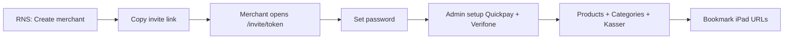
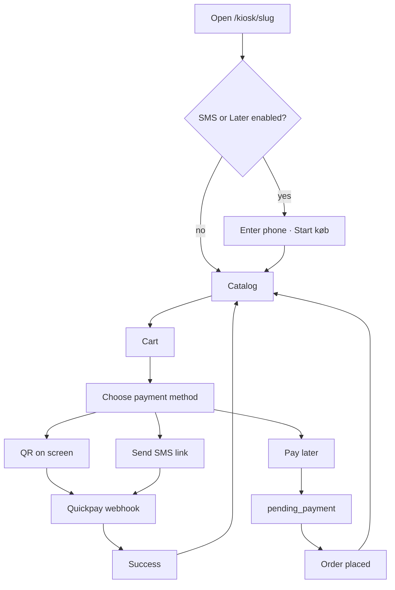
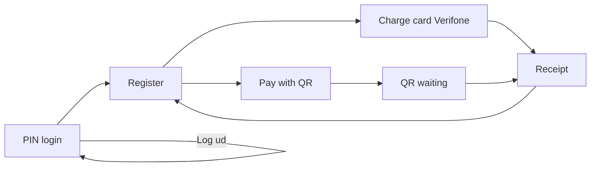

# POS — page features & flows (implementation reference)

**Companion to:** [interactive.html](./interactive.html) · [design spec](../superpowers/specs/2026-06-08-pos-three-sites-design.md)  
**Purpose:** One place per page — what it does, who uses it, where it goes next. Use when writing the implementation plan.

---

## Global flows

### Onboarding (new merchant)

### Customer kiosk (self-service)

Like [pos.rns-apps.dk](https://pos.rns-apps.dk/) — merchant enables **QR**, **SMS**, and/or **Pay later** per self-service kasse.

### Staff kasse register cart

| Action | UI |
|--------|-----|
| Update qty | `+` / `−` on sale panel |
| Remove line | `×` on line |
| Clear cart | “Ryd kurv” |

---

### Staff kasse (register)

### Data on every order

| Channel | `kasseId` | `staffUserId` | Payment |
|---------|-----------|---------------|---------|
| Kiosk QR | From kiosk URL | null | Quickpay online (`paymentMethod: qr`) |
| Kiosk SMS | From kiosk URL | null | Quickpay link via SMS (`paymentMethod: sms`) |
| Kiosk later | From kiosk URL | null | No payment at checkout (`paymentMethod: later`, `pending_payment`) |
| Kasse terminal | From kasse URL | From PIN session | Verifone |
| Kasse QR | From kasse URL | From PIN session | Quickpay online |

### CRUD (create, update, delete)

**Principle:** Prefer **deactivate** (`isActive: false`) over hard delete. Mutations return the updated row — client updates list state from the response (no refetch). Full API table: spec §3.13.

| Resource | Create | Update | Delete |
|----------|--------|--------|--------|
| Product | POST (multipart) | PATCH fields, image, visibility | Deactivate; remove image |
| Category | POST | PATCH name, sort, active | Deactivate; DELETE if 0 products |
| Kasse | POST | PATCH name, slug, type, POI, payment toggles | Deactivate; no delete if orders |
| Staff | POST | PATCH name, PIN, active | Deactivate only |
| Setup | — | PUT Quickpay / Verifone | — |
| Platform merchant | POST | PATCH name, contact | **Archive** → **Erasure** (GDPR §3.14); export ZIP first |
| Platform note | POST | — v1 | — v1 |
| Order | Checkout | — | Read-only v1 |

**Cart (kiosk + kasse):** update qty (`+/−`), remove line (`×`), clear cart — client-only until checkout POST validates.

---

### Product images (all catalog surfaces)

| Step | Behaviour |
|------|-----------|
| Admin upload | File picker on add/edit product → `multipart/form-data` |
| Storage | Server saves under tenant-scoped path; `Product.imageKey` in DB |
| Serve | API returns `imageUrl` on product + catalog responses |
| iPad | Kiosk/kasse tiles use `imageUrl`; placeholder if none |
| Replace/remove | Edit product overwrites or deletes stored file |

---

## Shared pages (all sites)

### `/` — Marketing landing

| | |
|--|--|
| **Auth** | Public |
| **Device** | Desktop / mobile |
| **Features** | Product overview, link to `/register` |
| **Exit** | Register, Login |

### `/login`

| | |
|--|--|
| **Auth** | Public → JWT |
| **Features** | Email + password; role determines redirect |
| **Exit** | `platform_admin` → `/platform/merchants`; `admin` → `/{slug}/admin/products` or last admin route; kasse staff → `/{slug}/kasse/{kasseSlug}` (if bookmarked) |

### `/register`

| | |
|--|--|
| **Auth** | Public (self-signup path; may coexist with RNS invite) |
| **Features** | Shop name, slug, admin email, password → creates tenant + admin user |
| **Exit** | `/{slug}/admin/setup` |

### `/invite/:token`

| | |
|--|--|
| **Auth** | Public (valid token) |
| **Features** | Set password for pre-created tenant; token single-use, expires |
| **API** | `POST /api/v1/auth/invite/:token` (accept) |
| **Exit** | `/{slug}/admin/setup` |

---

## Site 1: RNS platform (desktop)

**Auth:** `platform_admin` only · **Layout:** top bar, no sidebar

### `/platform/merchants` — Merchant list

| Features | Flow |
|----------|------|
| Paginated table (name, slug, status, Quickpay, created) | **From:** Login |
| Status derived from Quickpay connection + ping only | |
| Search + filters (status, date, email) | **To:** Detail, Create merchant |
| Row action: Open merchant | |
| Button: + New merchant | |
| **API:** `GET /api/v1/platform/merchants` | |

### `/platform/merchants/new` — Create merchant

| Features | Flow |
|----------|------|
| Form: shop name, slug (preview URL) | **From:** Merchant list |
| Optional contact email (RNS notes only) | **To:** Invite link ready |
| Button: Create merchant (no auto-email) | |
| **API:** `POST /api/v1/platform/merchants` | |

### Invite link ready (same route, post-create state)

| Features | Flow |
|----------|------|
| Show copyable `payment.rns-apps.dk/invite/{token}` | **From:** Create merchant |
| Copy button, expiry note (7d, single use) | **To:** Merchant detail, Create another |
| Does **not** send email | |

### `/platform/merchants/:tenantId` — Merchant detail

| Features | Flow |
|----------|------|
| Summary + status badge | **From:** Merchant list |
| Quick links: shop, setup, webhook URL (read-only) | **To:** Kiosk preview, Admin setup |
| Quickpay: **enter** merchant no. + keys (write-only); ping status only | |
| Does **not** show saved keys, webhook URL, or merchant admin setup | |
| Support notes: list + add (RNS-only); edit/delete notes v1.1 | |
| **Update merchant:** PATCH name, contact email | |
| **GDPR danger zone:** Export data · Archive · Request erasure (purge PII) | |
| Erasure keeps **anonymised** orders until legal retention (e.g. 5y DK bookkeeping) | |
| **API:** `GET`, `PATCH`, `PUT .../quickpay`, `POST .../notes`, `GET .../export-data`, `POST .../archive`, `POST .../request-erasure` | |

---

## Site 2: Merchant admin (desktop)

**Auth:** `admin` JWT · `tenantId` must match `/:slug` · **Layout:** sidebar

### `/admin/products` — Product list

| Features | Flow |
|----------|------|
| Paginated products (thumbnail, name, category, price, which iPads) | **From:** Sidebar |
| + Add product | **To:** New, Edit |
| **API:** `GET /api/v1/products` (includes `imageUrl`) | |

### `/admin/products/new` — Add product

| Features | Flow |
|----------|------|
| Name, price (ore), category dropdown | **From:** Product list |
| **Image upload** (JPEG/PNG/WebP, max 2 MB) — saved on server | |
| Preview after file select | **To:** Product list |
| Visible on: checkboxes per kasse (default all) | |
| **API:** `POST /api/v1/products` (multipart) + `ProductKasse` rows | |

### `/admin/products/:id` — Edit product

| Features | Flow |
|----------|------|
| Same as new + active toggle | **From:** Product list |
| Current image thumbnail; replace or remove | **To:** Product list |
| **Save** updates fields; **Deactivate** sets `isActive: false` | |
| **Remove image** deletes file server-side | |
| **API:** `PATCH /api/v1/products/:id`, optional `DELETE .../image` | |

### `/admin/categories` — Category list

| Features | Flow |
|----------|------|
| Name, sort order, product count, active | **From:** Sidebar |
| + Add category | **To:** New, Edit |
| **API:** `GET /api/v1/categories` | |

### `/admin/categories/new` · `/admin/categories/:id`

| Features | Flow |
|----------|------|
| Name, sort order (chip order on iPad) | **From:** Category list |
| **Save** (PATCH); **Deactivate**; **Delete** if 0 products | **To:** Category list |
| **API:** `POST /api/v1/categories`, `PATCH /api/v1/categories/:id`, `DELETE .../categories/:id` | |

### `/admin/kasser` — Kasser list

| Features | Flow |
|----------|------|
| All iPads in one list (self-service + registers) | **From:** Sidebar |
| Columns: name, **type**, link, terminal, product count | **To:** Edit, Add |
| Type shown as **Self-service** or **Register** | |
| Copy iPad URL per row (path depends on type) | |
| **API:** `GET /api/v1/kasser` | |

### `/admin/kasser/new` — Add kasse

| Features | Flow |
|----------|------|
| **Type (required):** Self-service or Register | **From:** Kasser list |
| Name, link slug — preview URL updates with type | **To:** Edit kasse |
| Self-service → `/kiosk/{slug}` · Register → `/kasse/{slug}` | |
| Verifone POI ID — **register only** (hidden for self-service) | |
| **API:** `POST /api/v1/kasser` with `type: kiosk \| register` | |

### `/admin/kasser/:id` — Edit kasse

| Features | Flow |
|----------|------|
| Same form as add — type, name, slug, copy link | **From:** Kasser list |
| Self-service: public link, no PIN, no terminal fields | |
| **Payment methods (self-service only):** Pay with QR, SMS, Pay later — at least one on | |
| Register: PIN at URL, optional POI, Charge + QR on iPad | |
| Product checklist (same as product form checkboxes) | |
| Changing type changes URL path — re-copy link to iPad | |
| **Save** (PATCH); **Deactivate** kasse — link stops working | |
| **API:** `PATCH /api/v1/kasser/:id`, `PUT .../products` | |

### `/admin/staff` — Staff list

| Features | Flow |
|----------|------|
| Floor staff for kasse PIN (not admin login) | **From:** Sidebar |
| Name, active, masked PIN | **To:** New, Edit |
| **API:** `GET /api/v1/staff` | |

### `/admin/staff/new` · `/admin/staff/:id`

| Features | Flow |
|----------|------|
| Display name, PIN (4–6 digits, hashed) | **From:** Staff list |
| **Save** (PATCH name/PIN); **Deactivate** — no hard delete | **To:** Staff list |
| **API:** `POST /api/v1/staff`, `PATCH /api/v1/staff/:id` | |

### `/admin/orders` — Order list

| Features | Flow |
|----------|------|
| Paginated; filter channel, kasse, employee | **From:** Sidebar |
| Columns: time, channel, kasse, employee, total, status | **To:** Order detail |
| **API:** `GET /api/v1/orders` | |

### `/admin/orders/:orderId` — Order detail

| Features | Flow |
|----------|------|
| Lines, totals, payment rail | **From:** Order list |
| Kasse slug + employee name (terminal) | **To:** Order list |
| **API:** `GET /api/v1/orders/:id` | |

### `/admin/setup` — Payment setup

| Features | Flow |
|----------|------|
| Quickpay: merchant ID, keys, connection status | **From:** Sidebar |
| Verifone: tenant credentials (shared) | |
| **Save** updates Quickpay or Verifone credentials | |
| Links to setup guides; link to Kasser for POI IDs | |
| **API:** `GET /api/v1/setup`, `PUT .../setup/quickpay`, `PUT .../setup/verifone` | |

---

## Site 3a: Customer kiosk (iPad)

**Auth:** None (public) · **URL identifies kasse:** `/:slug/kiosk/:kasseSlug`  
**Payment methods:** Configured on self-service kasse — see spec §3.12.

### `/:slug/kiosk/:kasseSlug/start` — Phone entry (conditional)

| Features | Flow |
|----------|------|
| Numeric phone pad + **Start køb** | **Entry:** iPad bookmark when SMS **or** Pay later enabled |
| Skipped when **only QR** enabled | **To:** Catalog |
| Phone stored in session for checkout | |
| **API:** Catalog response includes `paymentMethods` flags | |

### `/:slug/kiosk/:kasseSlug` — Catalog

| Features | Flow |
|----------|------|
| Products for this kiosk kasse only | **Entry:** iPad bookmark (QR-only) or after phone screen |
| Category chips (from merchant categories) | **To:** Cart (tap product or cart badge) |
| Large touch tiles with **product image** (or placeholder), sticky cart footer | |
| Idle timeout → same catalog URL | |
| **API:** `GET /api/v1/kiosk/:kasseSlug/catalog` (products include `imageUrl`, enabled payment methods) | |

### `.../cart` — Cart

| Features | Flow |
|----------|------|
| Line items, **+/− qty**, **remove line (×)**, **clear cart** | **From:** Catalog |
| Total | **To:** Checkout (method picker), Catalog |
| **API:** Client cart state; validate on checkout POST | |

### `.../checkout` — Payment method picker

| Features | Flow |
|----------|------|
| Total + large buttons for **enabled** methods only | **From:** Cart |
| QR · SMS · Pay later (merchant toggles) | **To:** QR screen, SMS confirm, Later confirm |
| Phone required for SMS/Later if not collected at `/start` | |
| **API:** `POST .../checkout` with `paymentMethod` | |

### `.../checkout/qr` — Pay with QR

| Features | Flow |
|----------|------|
| Full-screen Quickpay QR on iPad | **From:** Method picker |
| Poll/webhook until paid or cancel | **To:** Success, Cancel |
| **API:** `POST .../checkout/qr` | |

### `.../checkout/sms` — Pay with SMS

| Features | Flow |
|----------|------|
| Confirm phone (pre-filled from session) | **From:** Method picker |
| Send Quickpay link by SMS | **To:** Success (webhook), Cancel |
| **API:** `POST .../checkout/sms` | |

### `.../checkout/later` — Pay later

| Features | Flow |
|----------|------|
| Confirm phone | **From:** Method picker |
| Order `pending_payment` — pay at counter later | **To:** Confirmation → Catalog |
| **API:** `POST .../checkout/later` | |

### `.../checkout/success` · `.../checkout/cancel`

| Features | Flow |
|----------|------|
| Thank you + auto-return countdown | **From:** Quickpay webhook (QR/SMS) or later confirmation |
| Cancel: retry method picker | **To:** Catalog or Cart |

---

## Site 3b: Staff kasse (iPad)

**Auth:** PIN session JWT · **URL identifies kasse:** `/:slug/kasse/:kasseSlug`

### `/:slug/kasse/:kasseSlug` — PIN login (no session)

| Features | Flow |
|----------|------|
| Numeric PIN pad | **Entry:** iPad bookmark |
| Rate-limited attempts | **To:** Register (valid PIN) |
| **API:** `POST /api/v1/kasse/:kasseSlug/pin` | |

### Same URL — Register (with PIN session)

| Features | Flow |
|----------|------|
| Header: kasse name + employee name | **From:** PIN |
| Product grid with images (this kasse only), category chips, search | **To:** Charge, QR, Log ud → PIN |
| Cart panel, clear cart | |
| **Charge card** if `verifonePoiId` set | **To:** Receipt |
| **Pay with QR** always (or only if no terminal) | **To:** QR screen |
| No cash | |
| **API:** `GET .../catalog`, `POST .../sales` | |

### `.../pay/qr` — QR payment

| Features | Flow |
|----------|------|
| Full-screen QR (Quickpay link) | **From:** Register |
| Poll/webhook until paid or cancel | **To:** Receipt, Register |
| **API:** `POST .../pay/qr`, webhook (shared Quickpay) | |

### `.../orders/:orderId` — Receipt (optional)

| Features | Flow |
|----------|------|
| Approved total, lines, employee, kasse | **From:** Charge or QR success |
| **To:** Register (next sale) | |

---

## Implementation phases (canonical)

Full roadmap: **[PLANS/not-integrated/003-pos-implementation-roadmap.md](../../PLANS/not-integrated/003-pos-implementation-roadmap.md)**

**Recommended (simpler):** 6 worktrees A–F — see [003 revision section](../../PLANS/not-integrated/003-pos-implementation-roadmap.md#revision--simpler-roadmap-recommended).

| Phase | Branch | Focus |
|-------|--------|-------|
| 0 | — | Auth, setup, platform, payments (mostly done) |
| **A** | `feature/merchant-catalog` | [004 plan](../../PLANS/not-integrated/004-phase-a-merchant-catalog.md) — shared UI + catalog admin |
| **B** | `feature/kiosk-checkout` | Kiosk + cart + QR + pay later (SMS → F) |
| **C** | `feature/staff-kasse` | PIN + register + Verifone + kasse QR |
| **D** | `feature/orders-attribution` | Order filters by kasse / employee |
| **E** | `feature/platform-archive` | Export + archive (full erasure later) |
| **F** | `feature/kiosk-sms` | SMS payment link (v1.1) |

Detailed 10-phase checklist remains in 003 for task breakdown. One worktree per phase — `git-worktree-workflow.mdc`.

---

## Out of scope v1

- Cash sales, cash drawer  
- Auto-email on invite (manual link only)  
- Limit on count of self-service kasser per tenant (model supports many; confirm v1 cap if any)  
- Analytics dashboards (data captured: `kasseId`, `staffUserId`)  
- Native iOS apps  
