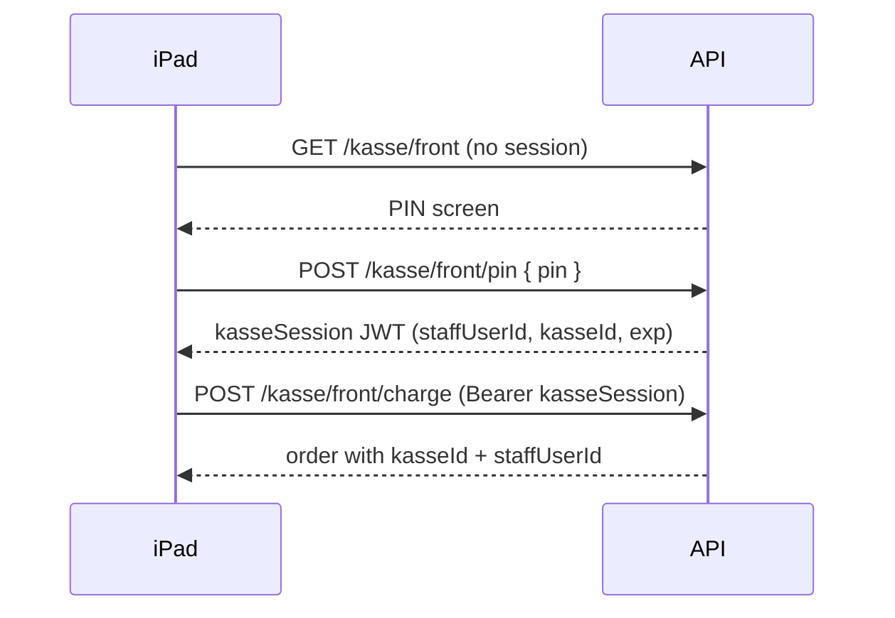
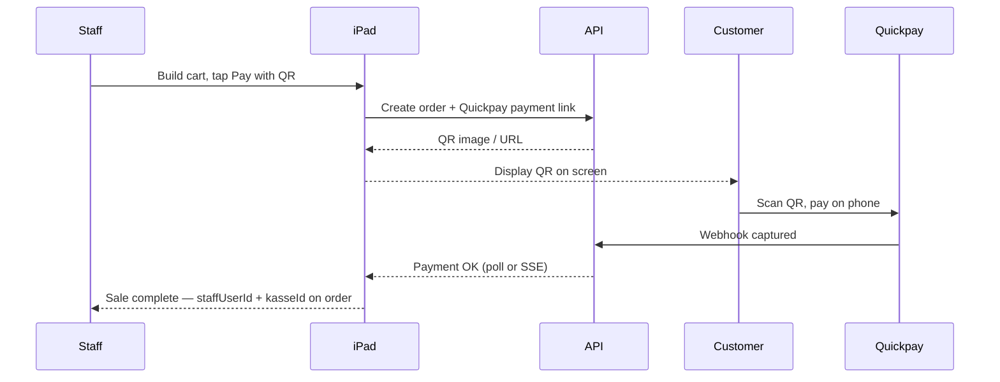
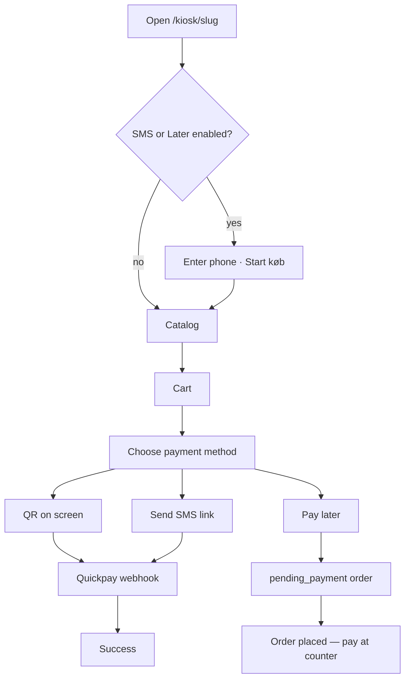
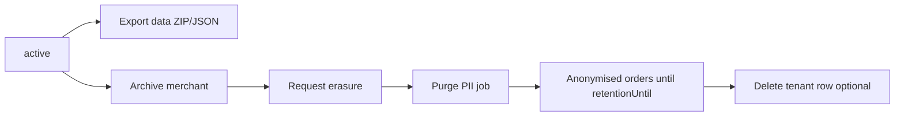
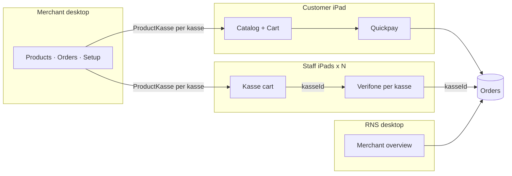

# POS three-site layout — design spec

**Plan #:** (brainstorming artifact — not a numbered PLANS entry)
**Status:** not integrated
**Created:** 2026-06-08
**Prototype:** [docs/design/interactive.html](../../design/interactive.html)  
**Page features & flows (implementation):** [docs/design/page-features-and-flows.md](../../design/page-features-and-flows.md)

---

## 1. Purpose

Define the **page map and layout** for a simple multi-tenant POS on iPad:

- **RNS platform** — RNS staff overview (desktop)
- **Merchant admin** — catalog, orders, payment setup (desktop)
- **Customer kiosk** — self-service catalog + Quickpay checkout (fixed iPad)
- **Staff kasse** — one or more register iPads, each optionally paired with a Verifone terminal

One Angular SPA (`payment.rns-apps.dk`), one API (`api.rns-apps.dk`). Route prefixes and layout shells separate the experiences.

---

## 2. Decisions (brainstorming)

| Topic | Choice |
|-------|--------|
| iPad model | **Kiosk iPad** (customer) + **one or more kasse iPads** (staff registers) |
| Customer flow | **Full catalog** — browse, cart, pay (Quickpay online) |
| Staff iPad scope | **Kasse only** — products, orders, setup, kasse management on laptop/desktop |
| Multiple kasser | Merchant creates **N kasser** in admin — each **Self-service** or **Register**; dedicated URL per iPad |
| Terminal pairing | **Optional per kasse** — Verifone `poiId` on register; tenant API credentials stay global in Setup |
| Payment attribution | Every sale stores **`kasseId`** (which iPad/register) for analytics |
| Product visibility | **Per-kasse catalog** — each iPad only shows products assigned to that kasse (see §3.7) |
| Categories | **Merchant-created** — named groups; drive filter chips on kiosk/kasse (see §3.8) |
| Cash | **No cash sales** in v1 |
| No-terminal kasse | **QR pay only** — Quickpay link on screen, customer scans (see §3.10) |
| Architecture | **Single SPA, three layout shells** (recommended over separate deploys) |
| iPad identity | **Dedicated URL per kasse** — bookmark link identifies register/kiosk (see §3.5) |
| Staff on kasse | **Employee PIN** (pinkode) — short session; sales store `staffUserId` (see §3.9) |

---

## 3. Sites and routes

### 3.1 RNS platform (desktop)

| Page | Route | Notes |
|------|-------|-------|
| Merchant list | `/platform/merchants` | Paginated, filters, status badges |
| Merchant detail | `/platform/merchants/:tenantId` | Quickpay ping, support notes |
| Create merchant | `/platform/merchants/new` | Pre-create tenant — generates **invite link** to copy (no auto-email) |
| Invite (customer) | `/invite/:token` | Merchant sets password, lands in setup |

**Layout:** Top bar + table or detail content. No sidebar at v1.

**Auth:** `platform_admin` only.

---

### 3.2 Merchant admin (desktop)

| Page | Route | Notes |
|------|-------|-------|
| Products | `/:slug/admin/products` | Paginated list |
| Add product | `/:slug/admin/products/new` | Name, price, category pick, **image upload**, iPad visibility |
| Edit product | `/:slug/admin/products/:id` | Deactivate, not hard delete |
| Categories | `/:slug/admin/categories` | Merchant-defined groups for catalog chips |
| Add category | `/:slug/admin/categories/new` | Name, sort order |
| Edit category | `/:slug/admin/categories/:id` | Rename, reorder, deactivate |
| Kasser | `/:slug/admin/kasser` | List all iPads — type, name, link, terminal, status |
| Add kasse | `/:slug/admin/kasser/new` | Name, **type (self-service or register)**, link slug, optional POI (register only) |
| Edit kasse | `/:slug/admin/kasser/:kasseId` | Save (PATCH), product checklist, deactivate kasse |
| Staff | `/:slug/admin/staff` | Employees + PIN for kasse access |
| Add staff | `/:slug/admin/staff/new` | Name, PIN |
| Edit staff | `/:slug/admin/staff/:userId` | Change PIN, deactivate |
| Orders | `/:slug/admin/orders` | Filter by channel, kasse, **employee** |
| Order detail | `/:slug/admin/orders/:orderId` | Kasse, employee, payment rail |
| Setup | `/:slug/admin/setup` | Quickpay + **tenant** Verifone credentials |

**Layout:** Left sidebar — **Products · Categories · Kasser · Staff · Orders · Setup**.

**Auth:** Merchant `admin`; JWT `tenantId` must match slug.

**Not on staff iPad** — desktop bookmark or login from laptop.

---

### 3.3 Customer kiosk (fixed iPad, landscape)

| Page | Route | Notes |
|------|-------|-------|
| Phone entry | `/:slug/kiosk/:kasseSlug/start` | When **SMS** or **Pay later** enabled — like [pos.rns-apps.dk](https://pos.rns-apps.dk/) |
| Catalog | `/:slug/kiosk/:kasseSlug` | Per self-service link — e.g. `/demo-shop/kiosk/customer` |
| Cart | `/:slug/kiosk/:kasseSlug/cart` | Review qty |
| Checkout | `/:slug/kiosk/:kasseSlug/checkout` | Pick enabled payment method (QR / SMS / Later) |
| Pay QR | `/:slug/kiosk/:kasseSlug/checkout/qr` | Full-screen Quickpay QR on iPad |
| Pay SMS | `/:slug/kiosk/:kasseSlug/checkout/sms` | Confirm phone → send payment link by SMS |
| Pay later | `/:slug/kiosk/:kasseSlug/checkout/later` | Confirm phone → order `pending_payment` |
| Success | `/:slug/kiosk/:kasseSlug/checkout/success` | Thank you → return to catalog |
| Cancel | `/:slug/kiosk/:kasseSlug/checkout/cancel` | Retry |

**Layout:**

- Sticky header: shop name + cart badge
- Category chips + large touch tiles (4-column grid)
- Sticky footer when cart non-empty
- No login, no admin/kasse links
- iPad Guided Access → bookmark **this kasse’s kiosk URL** (from admin)

**Payment:** Merchant-enabled methods per self-service kasse (§3.12). All online rails use Quickpay BYOK. `kasseId` from URL slug (server-resolved).

**Idle behaviour:** After success or N minutes idle → redirect to same kiosk catalog URL.

**Catalog:** Products assigned to **this kiosk kasse** (see §3.7). Multiple self-service iPads = multiple kiosk kasser with different links.

---

### 3.4 Staff kasse (one or more iPads, landscape)

| Page | Route | Notes |
|------|-------|-------|
| PIN login | `/:slug/kasse/:kasseSlug` | Employee pinkode — no sale without valid PIN session |
| Register | `/:slug/kasse/:kasseSlug` | Same URL after PIN — product grid + cart |
| QR payment | `/:slug/kasse/:kasseSlug/pay/qr` | Full-screen QR — wait for Quickpay webhook |
| Receipt | `/:slug/kasse/:kasseSlug/orders/:orderId` | Optional — inline success may suffice |

**Layout:**

- **PIN screen** — numeric pad, employee name after success (e.g. “Hej, Maria”)
- Split register: catalog quick-add (left) + current sale (right)
- Header: `{kasse name}` · `{employee name}` + **Log out** (clears PIN session)
- **Charge card** → Verifone using **this kasse’s** `poiId` (only when terminal configured)
- **Pay with QR** → Quickpay payment link as QR on screen — customer scans with phone (when no terminal, or as alternative)
- **No cash sales** — no manual/cash capture in v1
- **Catalog filtered** to products assigned to this kasse only

**Payment:**

| Kasse has terminal? | Primary action | Channel |
|---------------------|----------------|---------|
| Yes | Charge card (Verifone) | `terminal` |
| No | Show QR (Quickpay link) | `online` |
| Yes (optional) | Show QR instead of terminal | `online` |

Server sets `order.kasseId` + `order.staffUserId` on all kasse-initiated sales (terminal and QR).

**Multi-iPad setup:**

1. Admin creates kasser under **Kasser** — each gets a unique **`kasseSlug`** and **copyable link**
2. iPad bookmarks e.g. `payment.rns-apps.dk/demo-shop/kasse/front`
3. Staff enters **PIN** at start of shift → session token (short-lived)
4. Multiple employees share one iPad — log out / timeout returns to PIN screen

---

### 3.5 Dedicated link per kasse (iPad identity)

| Approach | How | Trade-off |
|----------|-----|-----------|
| **A. Unique URL per kasse** ✓ | `kiosk/{slug}` or `kasse/{slug}` — server resolves `kasseId` | Simple setup; merchant copies link to iPad |
| B. Pairing code + device token | Separate pair step | Extra friction vs bookmark |
| C. Staff picks kasse at login | Dropdown | Wrong register risk |

**Recommendation:** **A** — each `Kasse` has `kasseSlug` (unique per tenant). Admin shows full URL with copy button.

| Type | URL pattern | Example |
|------|-------------|---------|
| Self-service (kiosk) | `/{tenantSlug}/kiosk/{kasseSlug}` | `/demo-shop/kiosk/customer` |
| Staff register | `/{tenantSlug}/kasse/{kasseSlug}` | `/demo-shop/kasse/front` |

- `/{tenantSlug}` alone → shop landing or redirect to primary kiosk (v1.1).
- Inactive kasse → 404. Wrong slug → 404.
- **Kasse URL alone is not enough to sell** — staff register requires PIN session (§3.9).

---

### 3.6 Data model — `Kasse` (self-service + register)

```prisma
model Kasse {
  id            String    @id @default(uuid())
  tenantId      String
  name          String    // "Front counter" | "Customer kiosk"
  kasseSlug     String    // URL segment: "front", "customer" — unique per tenant
  type          String    // "kiosk" | "register"
  verifonePoiId String?   // optional terminal
  isActive      Boolean   @default(true)
  createdAt     DateTime  @default(now())
  updatedAt     DateTime  @updatedAt
  products      ProductKasse[]
  orders        Order[]
  tenant        Tenant    @relation(...)

  @@unique([tenantId, kasseSlug])
}
```

#### Kasse type (required on create)

Every kasse has `type: kiosk | register`. Merchant chooses **Self-service** or **Register** when adding a kasse.

| Type | Admin label | iPad URL | Auth | Terminal POI | Payment |
|------|-------------|----------|------|--------------|---------|
| `kiosk` | **Self-service** | `/{slug}/kiosk/{kasseSlug}` | None (public) | Hidden | Customer Quickpay |
| `register` | **Register** | `/{slug}/kasse/{kasseSlug}` | Employee PIN | Optional | Charge card and/or QR |

**Admin UX**

- **Add kasse:** required type selector; link preview shows `/kiosk/…` or `/kasse/…`; POI field only when type = register.
- **Edit kasse:** same form for both types; changing type changes URL path — merchant must re-copy link to iPad.
- **List:** type column (Self-service / Register); one screen for all iPads.

**Defaults**

- On tenant create: seed one self-service kasse (`name: "Customer kiosk"`, `kasseSlug: "customer"`).
- Merchant adds more of either type from **Kasser**.

**Order additions:**

```prisma
model Order {
  // existing fields…
  kasseId     String?   // from URL — kiosk or register
  staffUserId String?   // from PIN session — terminal sales; null for self-service
  kasse       Kasse?    @relation(...)
  staffUser   User?     @relation(...)
}
```

- **Kiosk orders:** `kasseId` from kiosk URL; `staffUserId` null
- **Terminal orders:** `kasseId` from kasse URL + `staffUserId` from PIN JWT — **never** from body alone
- **Analytics:** `GROUP BY kasseId`, `GROUP BY staffUserId`, combined reports later

**Verifone config split:**

| Level | Fields |
|-------|--------|
| Tenant (`tenant_verifone_config`) | `userUid`, `apiKey`, `saleId`, simulator flag — shared credentials |
| Kasse | `verifonePoiId` optional — which physical terminal this register uses |

---

### 3.9 Employee PIN (pinkode) on kasse

Staff registers are shared iPads. **PIN identifies the employee** for each sale — not email/password on the floor.

#### Staff model

Extend `User` (or `role: staff`):

```prisma
model User {
  // existing…
  displayName String?   // "Maria" — shown on kasse header
  pinHash     String?   // bcrypt — only for role staff (and optionally admin)
  isActive    Boolean   @default(true)
}
```

- **Admin** — email + password on desktop (existing).
- **Staff** — `displayName` + PIN; optional email v1.1 for invites.
- PIN length: **4–6 digits** (merchant configurable range v1.1; default 4).
- Rate-limit PIN attempts per kasse IP/session.

#### Session flow



- **kasseSession JWT** — short TTL (e.g. 8h shift or 30 min idle); separate from admin JWT.
- **Log out** or idle timeout → PIN screen again.
- `PaymentAction.actorUserId` = same staff user for refunds/voids audit.

#### Admin

- **Staff** list: name, active, last sale (v1.1).
- Set / reset PIN on create and edit.
- Deactivate staff → PIN stops working immediately.

---

### 3.10 QR payment (no cash)

**No cash** on kasse — ever in v1. Registers without a Verifone terminal (or when staff chooses QR over terminal) use **scan-to-pay**.

#### Flow (kasse, no terminal or “Pay with QR”)



- Same **Quickpay BYOK** as kiosk — tenant keys from setup.
- **QR encodes** Quickpay Payment Window / payment link URL (per Quickpay docs).
- **Webhook + idempotency** — same path as kiosk checkout.
- Order `channel`: `online` (Quickpay); attribution still has `kasseId` + `staffUserId` (staff rang up, customer paid via phone).
- **No cash** button, no “mark as paid” without gateway confirmation.

#### Kasse UI states

| State | Screen |
|-------|--------|
| Register | Cart + **Charge card** (if terminal) + **Pay with QR** |
| Awaiting QR payment | Full-screen QR + “Waiting for payment…” + cancel |
| Paid | Receipt / next sale |

#### Out of scope

- Cash drawer, manual payment, partial cash + card
- MobilePay native SDK (v1 uses Quickpay link QR only)

---

### 3.12 Customer payment methods (self-service / phone POS)

Merchants configure **which ways customers can pay** on each **self-service** (`type: kiosk`) kasse — same idea as [pos.rns-apps.dk](https://pos.rns-apps.dk/) (phone gate + flexible checkout).

#### Admin (per self-service kasse)

On **Edit self-service** kasse:

| Toggle | Customer experience |
|--------|---------------------|
| **Pay with QR** | Quickpay payment link as QR on iPad (or redirect) — customer scans and pays on phone |
| **Pay with SMS** | Server sends Quickpay payment link to customer’s mobile number |
| **Pay later** | Order created without immediate payment; customer pays at counter later |

- At least **one** method must stay enabled.
- Defaults for new kiosk kasse: QR **on**, SMS **off**, Later **off** (merchant opts in).
- Staff **register** kasser keep §3.10 (terminal + QR on kasse) — these toggles apply to **kiosk only** in v1.

#### Data model (on `Kasse`, kiosk type only)

```prisma
model Kasse {
  // …existing fields
  payWithQrEnabled    Boolean @default(true)  @map("pay_with_qr_enabled")
  payWithSmsEnabled   Boolean @default(false) @map("pay_with_sms_enabled")
  payWithLaterEnabled Boolean @default(false) @map("pay_with_later_enabled")
}

model Order {
  // …existing fields
  customerPhone   String?  // E.164 or national — collected when SMS/Later used
  paymentMethod   String?  // qr | sms | later | terminal
  // later → status pending_payment until staff marks paid or customer pays via link
}
```

Public catalog API returns enabled methods so the client only shows allowed buttons.

#### Customer flow



**Phone entry (`/start` or first screen)**

- Shown when **SMS** or **Pay later** is enabled (matches phone POS: customer identifies before shopping).
- Numeric pad + **Start køb** → session stores `customerPhone` for checkout.
- If **only QR** enabled → skip phone; land on catalog.

**Checkout — method picker**

- Show only enabled methods (large touch buttons).
- **QR:** create order + Quickpay link → full-screen QR (or redirect) → webhook → success.
- **SMS:** use stored phone (or prompt if skipped earlier) → `POST .../checkout/sms` → SMS provider sends link → poll/webhook → success.
- **Later:** require phone → create order `status: pending_payment`, `paymentMethod: later` → confirmation (“pay at counter”) → catalog.

**Validation**

- Phone required when customer chooses **Later** or **SMS** (even if they skipped `/start` when only QR was enabled initially).
- Server validates enabled methods — reject disabled method in API.

#### SMS integration (v1)

- Send **Quickpay payment link URL** via SMS (provider TBD — e.g. Twilio / GatewayAPI).
- Server-only; template per tenant language.
- Same webhook path as QR when customer pays from SMS link.

#### Pay later (v1)

- No Quickpay call at checkout.
- Order visible in merchant **Orders** with status `pending_payment` + `customerPhone`.
- Staff completes payment later via kasse or manual process (v1.1: “collect payment” action).

---

### 3.7 Product visibility per iPad (kasse)

Each **iPad is tied to one kasse**. Product visibility is configured **per kasse**, so different iPads can show different menus.

#### Approaches

| Approach | How | Trade-off |
|----------|-----|-----------|
| **A. Product ↔ Kasse many-to-many** ✓ | Join table; edit from product or kasse screen | Flexible; one source of truth |
| B. Category rules per kasse | “Terrace shows Drinks only” | Less control; odd for single items |
| C. Duplicate menus per kasse | Copy product rows per kasse | Bad for price updates |

**Recommendation:** **A** — `ProductKasse` join table.

#### Kasse types

See §3.6 — `type: kiosk | register` chosen in admin as **Self-service** or **Register**.

- On tenant create: seed one self-service kasse (`name: "Customer kiosk"`).
- Merchant adds more of either type from **Kasser** (each gets its own link and product subset).

#### Data model

```prisma
model Product {
  id         String         @id @default(uuid())
  tenantId   String
  name       String
  priceOre   Int
  categoryId String?        // → Category (§3.8)
  imageKey   String?        @map("image_key") // tenant-scoped storage key; null = placeholder on iPad
  isActive   Boolean        @default(true)
  kasser     ProductKasse[]
}

model ProductKasse {
  tenantId  String
  productId String
  kasseId   String
  product   Product @relation(...)
  kasse     Kasse   @relation(...)

  @@id([productId, kasseId])
  @@index([tenantId, kasseId])
}
```

#### Rules

| Rule | Behaviour |
|------|-----------|
| New product default | **Visible on all active kasser** (kiosk + registers) unless merchant unchecks |
| Inactive product | Hidden everywhere regardless of assignment |
| API catalog | Server filters by `kasseId` — **never** trust client-sent product list at checkout |
| Kiosk `/:slug` | Resolve tenant → tenant’s kiosk kasse → return assigned products |
| Kasse `/:slug/kasse` | Resolve `kasseId` from device token → return assigned products |
| Orders | `kasseId` set for **both** kiosk and terminal sales (kiosk kasse id for self-service) |

#### Admin UX (two editors, same data)

1. **Product edit** — “Visible on” checkboxes: ☑ Customer kiosk · ☑ Front counter · ☑ Terrace  
2. **Kasse edit** — searchable checklist of products for this register (bulk toggle)

#### Example

| Product | Customer kiosk | Front counter | Terrace |
|---------|----------------|---------------|---------|
| Latte | ✓ | ✓ | ✓ |
| Croissant | ✓ | ✓ | ✗ |
| Wine | ✗ | ✓ | ✓ |
| Merch | ✓ | ✗ | ✗ |

---

### 3.8 Categories

Merchants create their own categories (Drinks, Food, Merch, etc.) instead of free-text on products.

#### Data model

```prisma
model Category {
  id        String    @id @default(uuid())
  tenantId  String
  name      String
  sortOrder Int       @default(0)  // lower = first chip on iPad
  isActive  Boolean   @default(true)
  createdAt DateTime  @default(now())
  updatedAt DateTime  @updatedAt
  products  Product[]

  @@unique([tenantId, name])
  @@index([tenantId, sortOrder])
}

model Product {
  // …existing fields
  categoryId String?   @db.Uuid
  category   Category? @relation(...)
}
```

- **One category per product** (optional — uncategorized products still appear under **All**).
- **Deactivate category** — hidden from iPad chips; products keep `categoryId` but chips won’t list it.
- **Delete category (v1)** — prefer deactivate; hard delete only if no products (or reassign prompt v1.1).

#### iPad behaviour

| UI | Source |
|----|--------|
| Chip **All** | Always first — all products visible on this kasse |
| Chip **Drinks**, **Food**, … | Active categories with ≥1 product assigned to **this kasse**, ordered by `sortOrder` |
| Empty category | Chip hidden on iPad until a visible product uses it |

Category chips are **per-kasse**: Terrace might show only Drinks + Food if Merch isn’t assigned there.

#### Admin UX

1. **Categories** — list with name, product count, sort order, active flag; drag or numeric sort (v1: numeric field).
2. **Add / edit category** — name + sort order.
3. **Product form** — dropdown “Category” populated from active categories (not free text).

#### Defaults

- No auto-seeded categories — merchant creates what they need.
- New products: category optional; default visibility still “all kasser”.

---

### 3.11 Product images (upload + stored)

Products have an **optional image** uploaded by the merchant in admin — **not** a pasted external URL.

#### Storage

| Concern | v1 behaviour |
|---------|----------------|
| Upload | `multipart/form-data` from add/edit product form |
| Path | Tenant-scoped key e.g. `tenants/{tenantId}/products/{productId}.{ext}` |
| DB | `Product.imageKey` — never store binary in Postgres |
| Serve | `GET /api/v1/{slug}/products/images/{productId}` (or signed public URL from object storage) |
| API shape | List/catalog responses include computed `imageUrl` for `` |
| Replace | New upload overwrites file + updates `imageKey`; old file deleted |
| Remove | Clear image → delete file, set `imageKey` null → iPad shows placeholder tile |
| Validation | JPEG, PNG, WebP; max 2 MB; reject other types |

#### Admin UX

- **Add product:** file picker + preview after select; save uploads then creates/updates product.
- **Edit product:** show current thumbnail; **Replace image** / **Remove image**.
- **Product list:** optional small thumbnail column.

#### iPad UX

- Kiosk + kasse catalog tiles show the stored image when `imageUrl` is present.
- Missing image → neutral placeholder (name + price still visible).

#### Implementation notes

- Dev: local `UPLOAD_DIR` on disk.
- Production (Render): persistent disk mount or S3-compatible object storage — ephemeral container FS alone is not enough.
- Tenant isolation: upload and serve paths always scoped by resolved `tenantId`; never accept `tenantId` from client body alone.

---

### 3.13 Create, update, delete (CRUD)

Every admin resource supports **create** and **update**. **Delete** means deactivate (soft) by default — hard delete only when safe.

#### Rules

| Rule | Behaviour |
|------|-----------|
| Soft delete | Set `isActive: false` — row kept for orders/history |
| Hard delete | `DELETE` only when no blocking references; else **409** |
| Response | Mutations return the **updated entity** in the body — client patches list state, no full refetch |
| Tenant scope | All paths under resolved `tenantId` from JWT + slug |

#### Merchant admin API

| Resource | Create | Update | Delete / deactivate |
|----------|--------|--------|---------------------|
| **Product** | `POST /api/v1/products` (multipart) | `PATCH /api/v1/products/:id` — name, price, category, `isActive`, image replace/remove, per-kasse visibility | **Deactivate:** `PATCH { isActive: false }`. No hard delete v1 |
| **Product image** | Part of POST/PATCH | Replace via PATCH multipart | **Remove:** `PATCH { removeImage: true }` or `DELETE .../products/:id/image` — deletes file + clears `imageKey` |
| **Product ↔ kasse** | Default on product create | `PUT /api/v1/kasser/:id/products` or PATCH product visibility checkboxes | Uncheck removes `ProductKasse` row |
| **Category** | `POST /api/v1/categories` | `PATCH /api/v1/categories/:id` — name, `sortOrder`, `isActive` | **Deactivate:** `PATCH { isActive: false }`. **Hard delete:** `DELETE .../categories/:id` only if **zero products** — else **409** |
| **Kasse** | `POST /api/v1/kasser` | `PATCH /api/v1/kasser/:id` — name, slug, type, `verifonePoiId`, payment toggles (kiosk), `isActive` | **Deactivate:** `PATCH { isActive: false }` — link stops serving catalog. Hard delete blocked if any orders (**409**) |
| **Staff** | `POST /api/v1/staff` | `PATCH /api/v1/staff/:id` — display name, new PIN, `isActive` | **Deactivate only** — never hard delete (sales history keeps `staffUserId`) |
| **Setup** | — | `PUT /api/v1/setup/quickpay`, `PUT /api/v1/setup/verifone` | Clear keys → v1.1 (`DELETE` or empty PUT) |
| **Order** | Created at checkout | — (read-only in admin v1) | Cancel `pending_payment` → v1.1 |

#### RNS platform API

| Resource | Create | Update | Delete |
|----------|--------|--------|--------|
| **Merchant** | `POST /api/v1/platform/merchants` | `PATCH .../merchants/:tenantId` — shop name, contact email | **Archive**, **export**, **erasure** — see §3.14 (platform admin only) |
| **Quickpay (platform)** | — | `PUT .../merchants/:tenantId/quickpay` (write-only) | — |
| **Support note** | `POST .../merchants/:tenantId/notes` | Edit note → v1.1 | Delete note → v1.1. **v1:** append-only list |

#### Cart mutations (kiosk + kasse — client state until checkout)

| Action | UI | Behaviour |
|--------|-----|-----------|
| **Update qty** | `+` / `−` on line | Client cart only; totals recalc |
| **Remove line** | `×` or qty → 0 | Remove product from cart |
| **Clear cart** | “Ryd kurv” (kasse) / “Tøm kurv” (kiosk) | Reset client cart |
| **Validate** | Checkout POST | Server re-prices from catalog; rejects inactive or unassigned products |

#### Admin UI patterns

- **Edit screens:** primary **Save** (`PATCH`) + secondary **Deactivate** (danger) where applicable.
- **Category with 0 products:** offer **Delete category** (hard) in addition to deactivate.
- **Lists:** show **Active** column; inactive rows still editable/reactivatable via edit form.
- **Kasse deactivate:** warn “iPad link will stop working — reactivate to restore.”

---

### 3.14 GDPR & merchant offboarding (EU)

**Yes — merchants must be deletable**, but not as a single “wipe everything” button. EU law (GDPR + national bookkeeping rules, e.g. Danish **bogføringsloven**) requires a **phased lifecycle**: stop processing → export on request → erase PII → retain only what law allows, anonymised.

RNS is **processor** for merchant operational data; the merchant is **controller** for their end-customer data (`customerPhone`, etc.). Platform admins run offboarding; merchants can request export/closure via support (v1.1: self-service request).

#### Tenant lifecycle states

```prisma
model Tenant {
  // …existing fields
  status           String   @default("active")  // active | archived | erasure_pending | purged
  archivedAt       DateTime? @map("archived_at")
  erasureRequestedAt DateTime? @map("erasure_requested_at")
  purgedAt         DateTime? @map("purged_at")
  retentionUntil   DateTime? @map("retention_until")  // end of legal hold for anonymised orders
}
```

| Status | Meaning | Public routes | Admin login |
|--------|---------|---------------|-------------|
| `active` | Normal operation | Work | Work |
| `archived` | Offboarded — no processing | **404** (slug inactive) | **Blocked** |
| `erasure_pending` | PII purge scheduled / in progress | 404 | Blocked |
| `purged` | PII removed; anonymised orders may remain until `retentionUntil` | 404 | Blocked |

Slug stays **reserved** while `archived` or `erasure_pending` (prevents reuse confusion). Released after `purged` + cooling period (e.g. 90 days) — v1.1.

#### Three platform actions (danger zone on merchant detail)



**1. Export data** (GDPR Art. 20 — portability)

- `GET /api/v1/platform/merchants/:tenantId/export-data` → ZIP or JSON
- Includes: tenant profile, products, categories, kasser, staff names (not PIN hashes), orders, payment metadata
- **Excludes:** Quickpay/Verifone secrets, raw webhook payloads with card data (we don’t store PANs)
- Offer **before** archive/erasure; log who exported and when

**2. Archive merchant** (offboard — reversible in v1)

- `POST /api/v1/platform/merchants/:tenantId/archive`
- Sets `status: archived`, `archivedAt`
- Deactivates all merchant `users`, invalidates invites, stops kiosk/kasse URLs
- **Optional:** wipe Quickpay/Verifone keys from DB (recommended — stops accidental processing)
- **Reversible:** `POST .../reactivate` while orders unchanged — v1.1
- Does **not** delete customer PII in orders yet

**3. Request erasure / purge PII** (GDPR Art. 17 — with legal exceptions)

- `POST /api/v1/platform/merchants/:tenantId/request-erasure`
- Requires: merchant already **archived**, confirmation (type shop name), audit log entry
- Async job `purgeTenantPii(tenantId)`:

| Data | Action |
|------|--------|
| Products, categories, kasser, staff, images | **Hard delete** |
| `TenantQuickpayConfig`, `TenantVerifoneConfig` | **Delete** |
| `PlatformMerchantNote`, `TenantInvite` | **Delete** |
| Merchant `users` | **Delete** (or anonymise email `deleted+{id}@rns.invalid`) |
| `Order.customerEmail`, `customerPhone`, free-text `description` | **Clear / anonymise** |
| `Order` amounts, dates, status, `quickpayOrderRef`, payment ids | **Keep** — legal retention (bookkeeping, disputes) |
| Staff on historical orders | `staffUserId` kept as UUID or replaced with sentinel — display name not stored on order row |
| Webhook event payloads | Delete or strip PII if any |

- Set `status: purged`, `purgedAt`, `retentionUntil = now + 5 years` (configurable; DK bookkeeping default)
- After `retentionUntil`: background job may delete remaining anonymised `Order`/`Payment` rows and finally `Tenant` row

#### What we must **not** do

- Hard-delete orders with live payment disputes without legal review
- Delete audit log of platform admin actions (who archived, who requested erasure)
- Expose one merchant’s export to another tenant
- Let merchant admin self-delete tenant without platform confirmation in v1 (support-mediated)

#### Merchant-facing (v1.1)

- `/:slug/admin/settings` → “Request account closure” → emails RNS / creates ticket
- Merchant can **export own orders** (paginated CSV) — subset of platform export

#### Compliance checklist (implementation)

- [ ] Platform export endpoint + audit log
- [ ] Archive blocks JWT, public slug, webhooks for tenant
- [ ] Erasure job with table-by-table manifest (test on staging)
- [ ] `retentionUntil` + scheduled purge job
- [ ] Privacy policy / DPA documents reference retention periods
- [ ] EU hosting documented (`render.yaml` region)
- [ ] Integration test: archive tenant A → tenant B unaffected; erasure clears PII, orders anonymised not deleted

#### UI (platform merchant detail)

**Danger zone** section:

1. **Export all data** — download ZIP  
2. **Archive merchant** — stop shop; confirm dialog  
3. **Delete personal data** — only when archived; explains retention of anonymised transactions  
4. Status badge: `active` / `archived` / `purged`

---

## 4. Shared routes

| Page | Route | Used by |
|------|-------|---------|
| Register (merchant signup) | `/register` | New merchants |
| Login | `/login` | Platform admin, merchant admin, kasse staff |
| Marketing landing | `/` | Public |

---

## 5. Data flow



- **Product master list** in admin; each kasse/iPad gets a **filtered subset** via `ProductKasse`.
- **Orders** record channel: `online` (kiosk/Quickpay) vs `terminal` (kasse/Verifone).
- **Terminal orders** always store `kasseId` for per-register analytics.
- **Tenant isolation:** all queries scoped by `tenantId` from slug or JWT; device token validated server-side.

---

## 6. Page count (v1)

| Surface | Pages |
|---------|-------|
| RNS platform | 2–3 |
| Merchant admin | 15 |
| Customer kiosk | 4–5 |
| Staff kasse | 3–4 |
| Shared | 2 |
| **Total** | **~25** |

---

## 7. Layout shells (Angular)

| Shell | Route prefix | Frame |
|-------|--------------|-------|
| `PlatformLayout` | `/platform/*` | Desktop |
| `AdminLayout` | `/:slug/admin/*` | Desktop sidebar |
| `KioskLayout` | `/:slug/kiosk/:kasseSlug/*` | iPad fullscreen, minimal chrome |
| `KasseLayout` | `/:slug/kasse/:kasseSlug/*` | iPad PIN + split register |

Implement as parent route components with `<router-outlet>` — no separate deploys.

---

## 8. Open iteration items

Track in [interactive.html](../../design/interactive.html) notes panel; resolve before implementation plan:

1. **Cart UX** — separate `/cart` page vs slide-over on catalog
1b. **SMS provider** — GatewayAPI vs Twilio vs other EU host
2. **Kasse receipt** — dedicated page vs inline toast after terminal approval
3. **QR on kasse with terminal** — offer both buttons, or QR only when no POI?
4. **New product default** — all kasser vs none until assigned (spec recommends all)
5. **Multiple self-service iPads** — supported via multiple `type: kiosk` kasser (each own link + menu); confirm v1 or v1.1?
6. **Category sort** — numeric field v1 vs drag-and-drop v1.1
7. **Platform create merchant** — in v1 or v1.1
8. **Kiosk idle timeout** — duration and whether to clear cart
9. **PIN session TTL** — 8h shift vs 30 min idle timeout
10. **PIN length** — 4 vs 6 digits default

---

## 9. Out of scope (v1)

- Merchant self-service “delete my account” (support / platform admin only in v1)
- Automatic slug release immediately after purge
- Custom domains per merchant
- Native iOS apps (web on iPad only)
- Cash sales and cash drawer
- Inventory / stock tracking
- Receipt printing
- Customer accounts / loyalty
- Impersonation (platform → merchant)

---

## 10. Testing implications

- Kiosk checkout uses tenant A Quickpay keys only (mock Quickpay)
- Kasse uses tenant A Verifone config + kasse A's `poiId` only
- Device token for kasse B cannot create orders attributed to kasse A
- Merchant A cannot see B products, kasser, or orders (403/404)
- Product deactivate hides item on all iPads; removing from one kasse hides only there
- Checkout rejects line items not assigned to the order’s kasse

---

## 11. References

- [PLANS/not-integrated/001-rns-platform-merchant-overview.md](../../../PLANS/not-integrated/001-rns-platform-merchant-overview.md)
- `payment-setup.mdc` — Quickpay (kiosk), Verifone (kasse)
- `tenant-security.mdc` — slug + JWT isolation
